# Release Process

This document describes the release process for spafw37, including continuous integration workflows, automated testing, changelog generation, and deployment to PyPI.

## Table of Contents

- [Overview](#overview)
- [Continuous Integration Workflows](#continuous-integration-workflows)
- [Prerequisites](#prerequisites)
- [Creating a Release](#creating-a-release)
- [Development Releases](#development-releases)
- [Release Modes](#release-modes)
- [What Happens During Full Release](#what-happens-during-full-release)
- [Post-Release Actions](#post-release-actions)
- [Version Numbering](#version-numbering)
- [Bugfix Branches](#bugfix-branches)
- [Manual Version Management](#manual-version-management)
- [Changelog Format](#changelog-format)
- [Troubleshooting](#troubleshooting)
- [Configuration](#configuration)

## Overview

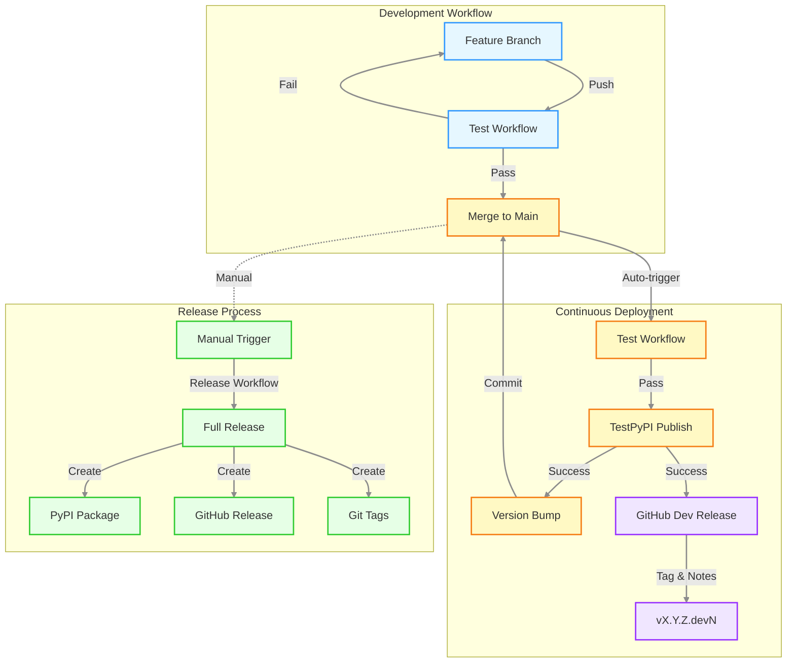

## Continuous Integration Workflows

spafw37 uses several automated workflows for testing, deployment, and changelog management:

### Test Workflow

Runs on every push and pull request to verify code quality:

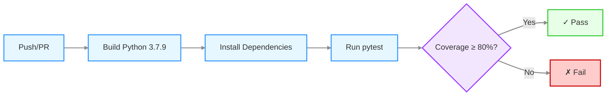

**Triggers:**
- Push to `main` or `develop` branches
- Pull requests to `main` or `develop` branches
- Manual workflow dispatch

**Actions:**
- Builds Python 3.7.9 from source with caching
- Installs project with development dependencies
- Runs pytest with 80% coverage requirement
- Reports test results and coverage

### TestPyPI Publish Workflow

Automatically publishes development versions to TestPyPI on every push to `main`:

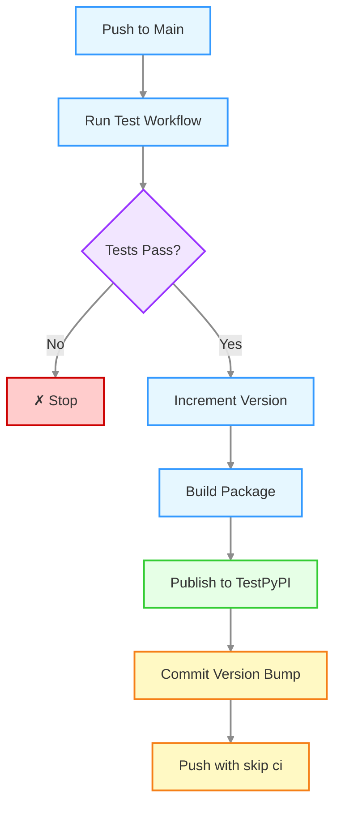

**Triggers:**
- Push to `main` branch (after successful Test workflow)

**Actions:**
1. Runs test workflow as dependency
2. Increments `.devN` suffix (e.g., `1.0.0.dev5` → `1.0.0.dev6`)
3. Builds wheel and source distribution
4. Publishes to TestPyPI
5. Commits version bump with `[skip ci]`

**Purpose:** Provides continuous deployment for testing development versions.

### Changelog Generation Workflow

Automatically updates `CHANGELOG.md` when feature/bugfix branches are pushed:

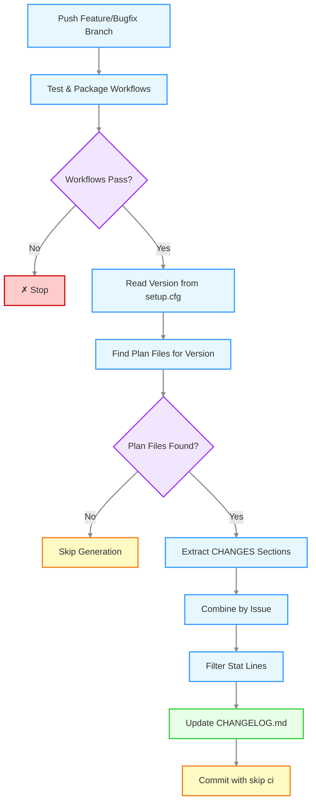

**Triggers:**
- Push to `feature/**` or `bugfix/**` branches
- After Test and Packaging workflows complete successfully

**Actions:**
1. Reads current development version from `setup.cfg`
2. Finds all plan files in `features/` targeting that version
3. Extracts CHANGES sections from each plan file
4. Combines sections organized by issue number
5. Filters out statistical summary lines
6. Updates or replaces version entry in `CHANGELOG.md`
7. Commits changes with `[skip ci]`

**Purpose:** Keeps changelog current during development without manual consolidation.

## Prerequisites

Before creating a release, ensure:

1. All changes for the release are merged to `main`
2. All tests are passing on `main`
3. PyPI Trusted Publisher is configured for this repository (see [Configuration](#configuration) below)
4. `CHANGELOG.md` is up to date (automatically maintained by changelog workflow)

## Creating a Release

Releases are created manually using GitHub Actions:

1. Go to the **Actions** tab in the GitHub repository
2. Select the **Release** workflow from the left sidebar
3. Click **Run workflow** button
4. Select the `main` branch (should be selected by default)
5. **Choose release mode:**
   - **full-release** (default): Complete release process with versioning, tagging, and branching
   - **docs-only**: Update PyPI documentation only without creating new version/tags
6. Click **Run workflow** to start the release process

## Development Releases

Development releases are automatically published to TestPyPI and GitHub whenever code is pushed to `main`.

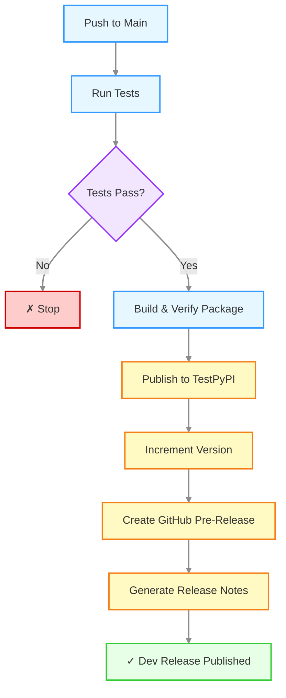

**What happens automatically:**

1. **Tests run** - Verifies 80% code coverage
2. **Package built** - Creates wheel and source distribution
3. **TestPyPI publish** - Uploads to test.pypi.org
4. **Version incremented** - Bumps `.devN` suffix (e.g., `1.2.0.dev5` → `1.2.0.dev6`)
5. **GitHub pre-release created** - Tags with version (e.g., `v1.2.0.dev6`)
6. **Release notes generated** - Includes:
   - TestPyPI installation instructions
   - Changelog extracted from issue plan files
   - Link to TestPyPI package

**Release notes behaviour:**

- **First dev release** (e.g., `v1.2.0.dev1`): Shows aggregated changelog for all issues targeting version 1.2.0
- **Subsequent releases** (e.g., `v1.2.0.dev2`, `v1.2.0.dev3`): Shows only changes from the current PR's associated issue

This ensures the first release provides complete context whilst subsequent releases show incremental changes.

**Accessing development releases:**

- **TestPyPI**: https://test.pypi.org/project/spafw37/
- **GitHub Releases**: Tagged as `vX.Y.Z.devN` and marked as pre-release

**Installing from TestPyPI:**

```bash
pip install --index-url https://test.pypi.org/simple/ --extra-index-url https://pypi.org/simple/ spafw37==1.2.0.dev6
```

**Note:** Development releases are separate from stable releases on PyPI and are automatically cleaned up after 30 days on TestPyPI.

## Release Modes

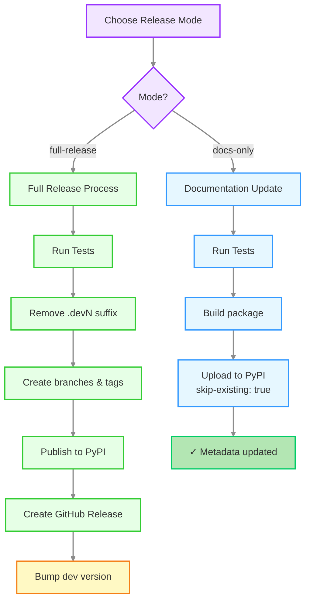

### Full Release Mode (Default)

Use this mode for standard releases when you want to:
- Create a new version of the package
- Update PyPI with code and documentation changes
- Create git tags and branches for the release
- Increment the development version

This is the normal release process you should use for most releases.

### Documentation-Only Mode

Use this mode when you need to:
- Update PyPI documentation (README) without changing code
- Fix documentation errors in an already-released version
- Refresh package metadata on PyPI

This mode:
- ✅ Runs all tests to verify current state
- ✅ Builds package with updated documentation
- ✅ Uploads to PyPI with `skip-existing: true` (updates metadata only)
- ⏭️  Skips git operations (no tags, branches, or commits created)
- ⏭️  Skips version bumping

**Note:** PyPI allows updating documentation without creating a new release by uploading with the same version number. The `skip-existing` flag ensures the existing release files aren't replaced, only metadata is updated.

## What Happens During Full Release

The release workflow automates the entire release process:

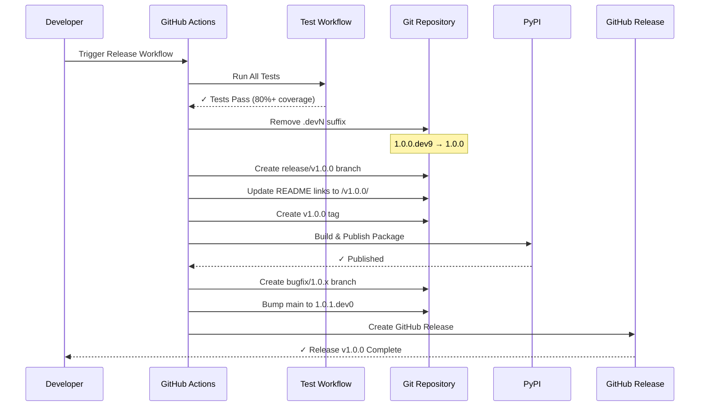

### Detailed Steps

1. **Runs all tests** - Verifies that all tests pass and coverage targets are met (80%)

2. **Removes development suffix** - Changes version from `X.Y.Z.devN` to `X.Y.Z` in `setup.cfg`

3. **Creates release branch** - Creates a `release/vX.Y.Z` branch with updated README links pointing to the tagged documentation

4. **Updates README links** - Changes all documentation and example links from `/main/` to `/vX.Y.Z/` so the README on the tag points to the correct tagged documentation

5. **Creates git tag** - Creates a version tag (e.g., `v1.0.0`) from the release branch and pushes it

6. **Creates bugfix branch** - Creates a `bugfix/X.Y.x` branch from the tag for future patch releases

7. **Publishes to PyPI** - Builds distribution packages and uploads them using PyPI Trusted Publisher (OIDC authentication, no API token needed)

8. **Bumps development version** - Increments the patch version and adds `.dev0` suffix on `main` (e.g., `1.0.0` → `1.0.1.dev0`)

9. **Creates GitHub Release** - Creates a GitHub Release with install instructions

All commits use `[skip ci]` to avoid triggering the test workflow unnecessarily.

### Version Flow Diagram

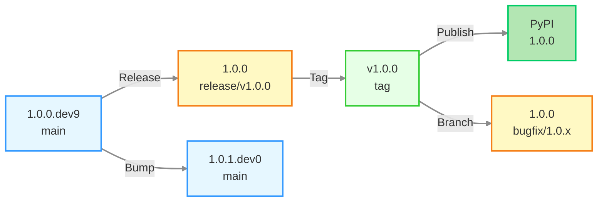

## Post-Release Actions

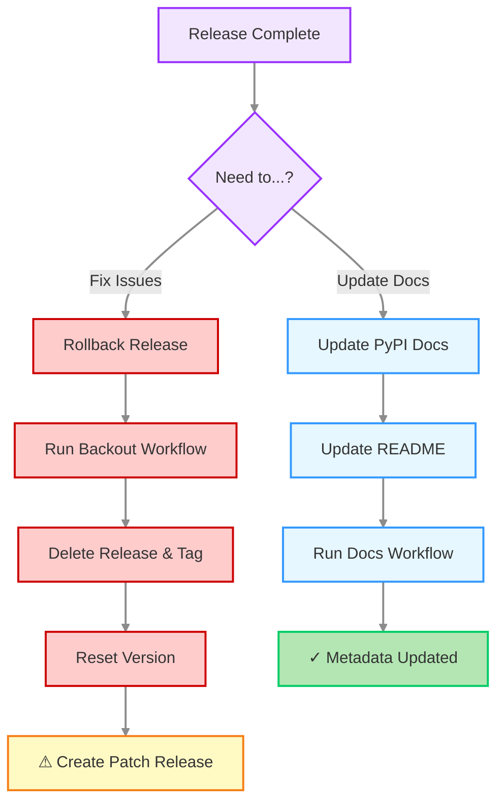

### Rolling Back a Release

If you need to rollback a release due to critical issues:

```mermaid
flowchart LR
    A[Critical Issue Found] --> B[Run Backout Workflow]
    B --> C[Enter Version]
    B --> D[Enter Reason]
    C --> E[Execute Backout]
    D --> E
    E --> F[Delete GitHub Release]
    F --> G[Delete Git Tag]
    G --> H[Delete Release Branch]
    H --> I[Reset Main Version]
    I --> J[⚠ PyPI Cannot Be Deleted]
    J --> K[Create Patch Release<br/>with Fixes]
    
    classDef errorStyle fill:#ffcccc,stroke:#cc0000,stroke-width:2px,color:#333
    classDef processStyle fill:#e6f7ff,stroke:#3399ff,stroke-width:2px,color:#333
    classDef warningStyle fill:#fff9c4,stroke:#f57f17,stroke-width:2px,color:#333
    classDef successStyle fill:#e6ffe6,stroke:#33cc33,stroke-width:2px,color:#333
    
    class A errorStyle
    class B,C,D,E,F,G,H,I processStyle
    class J warningStyle
    class K successStyle
    
    linkStyle default stroke:#8c8c8c,stroke-width:2px
```

**Steps:**

1. Go to the **Actions** tab in the GitHub repository
2. Select the **Backout Release** workflow
3. Click **Run workflow** button
4. Enter the version to backout (e.g., `1.0.0`)
5. Enter a reason for the backout
6. Click **Run workflow**

The backout workflow will:
- Delete the GitHub Release
- Delete the git tag (local and remote)
- Delete the release branch
- Reset the main branch version to development

**Important:** The PyPI package cannot be deleted due to PyPI policy. You must create a new patch release with fixes instead.

### Updating PyPI Documentation

If you need to update the documentation on PyPI (README, description, etc.) after a release without creating a new version:

1. Update the documentation files (README.md, etc.) on the release tag or create a new commit
2. Create and push a new tag for the same version (you may need to delete the old tag first)
3. Go to the **Actions** tab in the GitHub repository
4. Select the **Update PyPI Documentation** workflow
5. Click **Run workflow** button
6. Enter the release version (e.g., `1.0.0`)
7. Click **Run workflow**

The workflow will:
- Check out the release tag
- Rebuild the package with updated documentation
- Re-upload to PyPI (using `skip-existing: true` to avoid conflicts)

**Note:** This only updates the metadata and documentation displayed on PyPI. The actual code package remains unchanged. PyPI may take a few minutes to refresh the project page.

## Version Numbering

spafw37 uses semantic versioning with development suffixes:

- **Release versions**: `X.Y.Z` (e.g., `1.0.0`, `1.2.3`)
- **Development versions**: `X.Y.Z.devN` (e.g., `1.0.1.dev0`, `1.0.1.dev5`)

The release workflow automatically:
- Removes `.devN` suffix for the release
- Increments the patch version (`Z`) by one after release
- Adds `.dev0` suffix for continued development

## Example Release Cycle

```
1.0.0.dev9        # Current development version
    ↓
1.0.0             # Release workflow removes .dev9
    ↓
[Tagged as v1.0.0 and published to PyPI]
    ↓
[Branch bugfix/1.0.x created from v1.0.0]
    ↓
1.0.1.dev0        # Workflow bumps to next dev version on main
    ↓
1.0.1.dev1        # TestPyPI workflow increments on each push
1.0.1.dev2
...
```

## Bugfix Branches

Each release automatically creates a bugfix branch for that release series:

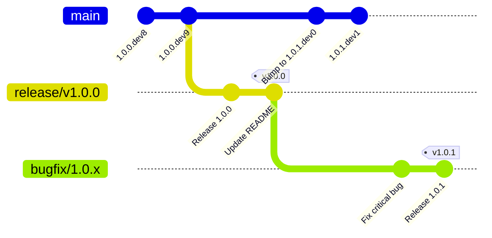

**Branch naming:**
- Release `1.0.0` creates branch `bugfix/1.0.x`
- Release `1.1.0` creates branch `bugfix/1.1.x`
- Release `2.0.0` creates branch `bugfix/2.0.x`

### Using Bugfix Branches

To create a bugfix release (e.g., `1.0.1` after `1.0.0` is released):

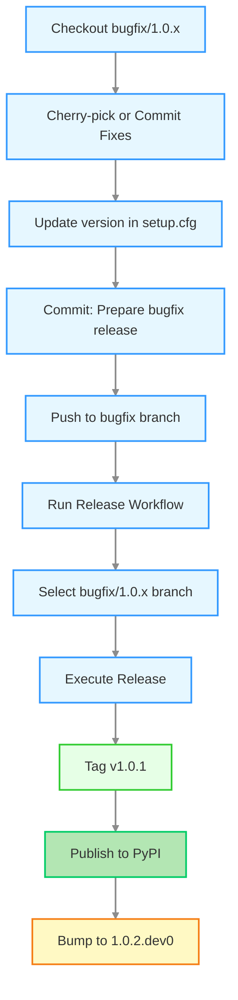

**Commands:**

1. **Cherry-pick or commit fixes** to the bugfix branch:
   ```bash
   git checkout bugfix/1.0.x
   git cherry-pick <commit-hash>
   # or make direct commits
   git commit -m "Fix critical bug"
   ```

2. **Update version** in `setup.cfg` manually:
   ```
   version = 1.0.1
   ```

3. **Commit the version change**:
   ```bash
   git commit -am "Prepare bugfix release 1.0.1 [skip ci]"
   git push origin bugfix/1.0.x
   ```

4. **Run release workflow** targeting the bugfix branch:
   - Go to Actions → Release → Run workflow
   - Select the `bugfix/1.0.x` branch (not main)
   - Click Run workflow

The workflow will:
- Tag as `v1.0.1`
- Publish to PyPI
- Update changelog
- Bump version to `1.0.2.dev0` on the bugfix branch

### When to Use Bugfix Branches

- Critical security fixes for older releases
- Bug fixes for production deployments not yet on latest version
- Maintaining multiple supported versions

**Note**: Regular development continues on `main`. Only use bugfix branches for patch releases to older versions.

## Manual Version Management

If you need to do a minor or major version bump instead of patch:

1. Manually edit `setup.cfg` before running the release workflow
2. Change version to desired release version (e.g., `1.1.0` or `2.0.0`)
3. Commit and push: `git commit -am "Prepare for X.Y.Z release [skip ci]"`
4. Run the release workflow as normal

The workflow will use whatever version is in `setup.cfg` (minus any `.dev` suffix) as the release version.

## Changelog Format

The `CHANGELOG.md` is automatically maintained during development and releases:

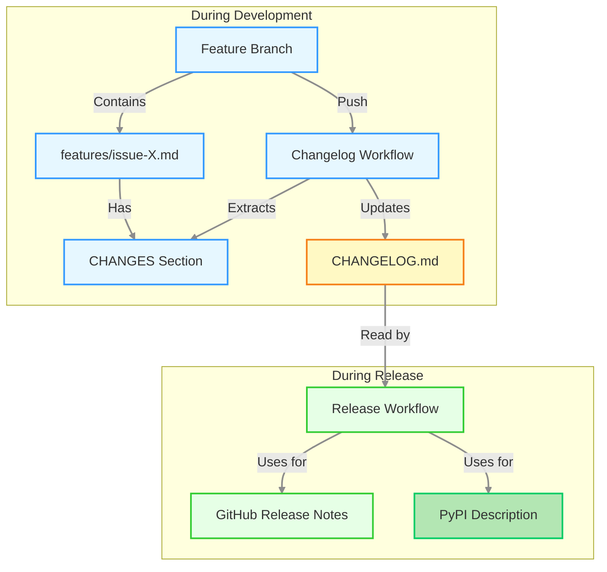

### Changelog Structure

The changelog is organized by version with sections grouped by issue:

```markdown
# Changelog

## [1.1.0] - 2025-11-24

### Issues Closed

- #26: Add Parameter Unset Capability
- #27: Pivot from Config Focus to Param Focus
- #33: Param Allowed Values

### Additions

**Issue #26:**

- `unset_param()` removes parameter value completely from configuration
- `reset_param()` restores parameter to default value
- `PARAM_IMMUTABLE` constant marks parameter as write-once

**Issue #27:**

- `get_param()` retrieves parameter value with automatic type conversion
- `set_param()` stores parameter value after validation
- `join_param()` adds to existing parameter value

### Changes

**Issue #26:**

- `set_param()` now checks immutability before modifications

**Issue #27:**

- Parameter getters consolidated to single `get_param()` function
- Parameter setters split into `set_param()` and `join_param()`

### Documentation

**Issue #26:**

- `doc/parameters.md` added section on unsetting and resetting parameters
- `examples/params_unset.py` demonstrates parameter lifecycle

**Issue #27:**

- `doc/parameters.md` added parameter API section
- `doc/api-reference.md` added Parameter API section
```

### Generation Process

1. **Automatic Extraction** - The changelog workflow extracts CHANGES sections from plan files in `features/`

2. **Organization by Issue** - Each section groups items by issue number for clarity

3. **Stat Line Filtering** - Statistical summary lines (e.g., "11 parameter examples changed") are automatically removed

4. **Version Targeting** - Plan files are matched to versions by:
   - Version in filename (e.g., `issue-26-param-1.1.0.md`)
   - Version in CHANGES header (e.g., `## CHANGES for v1.1.0 Release`)

### Manual Changelog Updates

While the changelog is automatically generated, you can manually edit it if needed:

1. Edit `CHANGELOG.md` directly
2. The next automatic generation will replace the version entry
3. To preserve manual edits, remove the plan files for that version from `features/`

## Troubleshooting

### Release Workflow Fails

If the release workflow fails:

1. Check the workflow logs in the Actions tab to identify the failure point
2. Common issues:
   - Tests failing (fix tests and retry)
   - Missing `PYPI_API_TOKEN` secret (add in repository settings)
   - Permission issues (check repository permissions)

### Version Already Published

If you try to publish a version that already exists on PyPI:

1. The workflow will fail at the PyPI upload step
2. You cannot overwrite existing PyPI versions
3. Manually increment the version in `setup.cfg` and retry

### Rollback a Release

To rollback a release:

1. The PyPI package cannot be deleted (PyPI policy)
2. Create a new patch release with fixes
3. You can delete the GitHub Release and tag if needed:
   ```bash
   git tag -d v1.0.0
   git push origin :refs/tags/v1.0.0
   ```

## Configuration

### PyPI Trusted Publisher

This project uses **PyPI Trusted Publisher** for secure, token-free publishing:

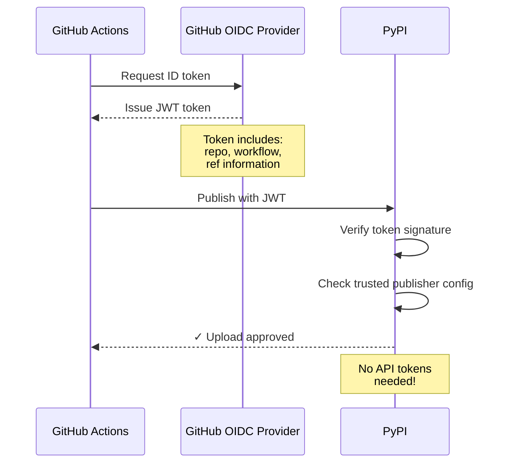

**How it works:**
1. GitHub Actions requests an OpenID Connect (OIDC) token
2. The token contains repository and workflow information
3. PyPI verifies the token and checks trusted publisher configuration
4. If configuration matches, upload is approved

**Setup** (one-time configuration):

1. Go to PyPI project settings: <https://pypi.org/manage/project/spafw37/settings/publishing/>
2. Add a new "Trusted Publisher":
   - **Owner**: `minouris`
   - **Repository name**: `spafw37`
   - **Workflow name**: `release.yml`
   - **Environment name**: (leave blank)
3. Save the configuration

**Benefits**:
- No API tokens to manage or rotate
- More secure (scoped to specific workflow)
- Automatic authentication via OIDC
- No secrets to configure in GitHub

### Workflow Permissions

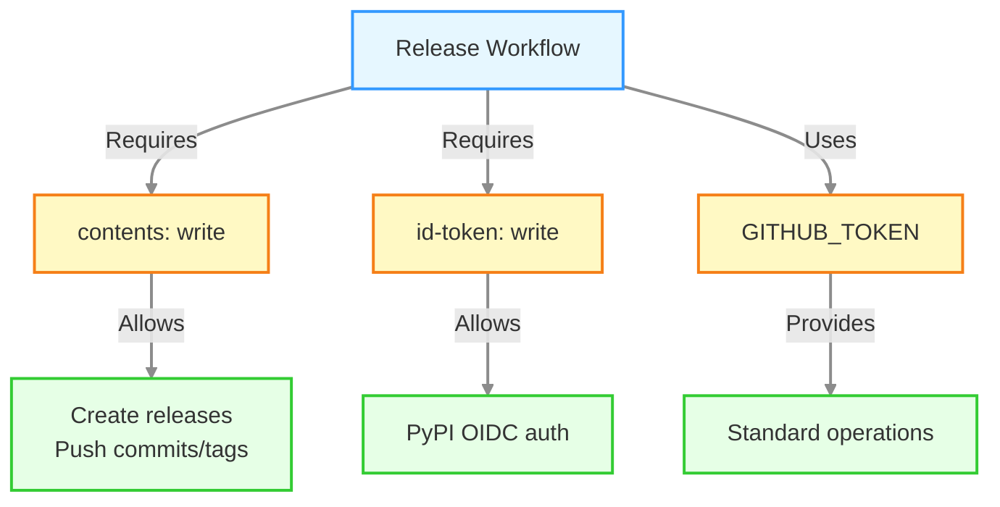

The release workflow requires:
- `contents: write` - For creating releases and pushing commits/tags
- `id-token: write` - For PyPI Trusted Publisher OIDC authentication
- Standard `GITHUB_TOKEN` permissions for other operations

### GitHub Secrets

The following secrets can be configured in repository settings:

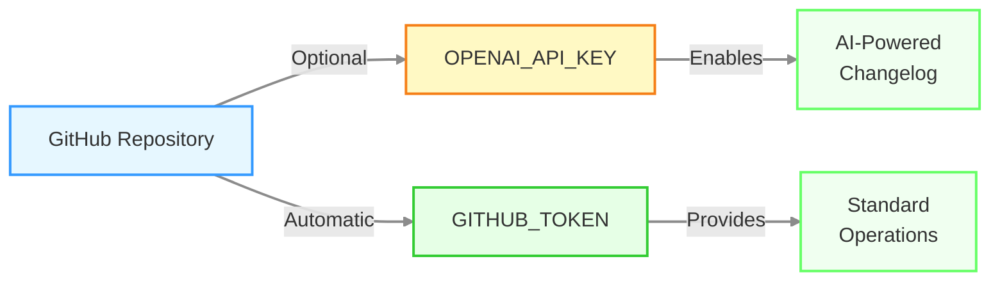

- `OPENAI_API_KEY` - *Optional* - OpenAI API key for AI-powered changelog generation (currently unused - changelog generated from plan files)
- `GITHUB_TOKEN` - Automatically provided by GitHub Actions
