# Release Process

[← Back to Main README](../README.md)

This document describes the release process for spafw37, including continuous integration workflows, automated testing, changelog generation, and deployment to PyPI.

## Table of Contents

- [Overview](#overview)
- [Continuous Integration Workflows](#continuous-integration-workflows)
  - [Workflow Architecture](#workflow-architecture)
  - [Pre-Publish Validation Workflow](#pre-publish-validation-workflow)
  - [Publish Dev Workflow](#publish-dev-workflow)
  - [Publish Stable Workflow](#publish-stable-workflow)
- [Prerequisites](#prerequisites)
- [Creating a Release](#creating-a-release)
- [Development Releases](#development-releases)
- [Manual Overrides](#manual-overrides)
- [What Happens During Stable Release](#what-happens-during-stable-release)
  - [Detailed Steps](#detailed-steps)
  - [Version Flow Diagram](#version-flow-diagram)
- [Post-Release Actions](#post-release-actions)
  - [Rolling Back a Release](#rolling-back-a-release)
- [Version Numbering](#version-numbering)
  - [Example Release Cycle](#example-release-cycle)
- [Bugfix Branches](#bugfix-branches)
  - [Using Bugfix Branches](#using-bugfix-branches)
  - [When to Use Bugfix Branches](#when-to-use-bugfix-branches)
- [Manual Version Management](#manual-version-management)
- [Changelog Format](#changelog-format)
  - [Changelog Structure](#changelog-structure)
  - [Generation Process](#generation-process)
  - [Manual Changelog Updates](#manual-changelog-updates)
- [Troubleshooting](#troubleshooting)
  - [Release Workflow Fails](#release-workflow-fails)
  - [Version Already Published](#version-already-published)
  - [Rollback a Release](#rollback-a-release)
- [Configuration](#configuration)
  - [PyPI Trusted Publisher](#pypi-trusted-publisher)
  - [Workflow Permissions](#workflow-permissions)
  - [GitHub Secrets](#github-secrets)

## Overview

[⬆ Back to Top](#table-of-contents)

spafw37 uses an automated release system with three independent workflows:

- **Pre-Publish Validation** - Automatically validates code on all branch pushes and pull requests to main. Runs tests, builds packages, and verifies metadata.
- **Development Releases** - Automatically publishes to TestPyPI when pre-publish validation succeeds on main. Tagged as `vX.Y.Z.devN` and marked as pre-releases on GitHub.
- **Stable Releases** - Manually triggered production releases published to PyPI. Tagged as `vX.Y.Z` with full release notes and GitHub release creation.

The architecture uses workflow dependencies to ensure code is validated before publishing, eliminating race conditions and duplicate work.

See the [Workflow Architecture](#workflow-architecture) section for detailed workflow descriptions.

## Continuous Integration Workflows

[⬆ Back to Top](#table-of-contents)

spafw37 uses several automated workflows for testing, deployment, and changelog management.

### Workflow Architecture

The release process uses three independent top-level workflows that coordinate through workflow dependencies:

#### Workflow Files Overview

**Validation Workflow:**

- **`pre-publish.yml`** - Pre-Publish Validation
  - **Triggers**: All branch pushes, pull requests to main
  - **Purpose**: Validates code quality before any publishing occurs
  - **Jobs**: prepare-python, test (80% coverage), build-and-verify
  - **Outputs**: Built and verified packages
  - **Concurrency**: Per-branch (allows parallel validation of different branches)

**Publishing Workflows:**

- **`publish-dev.yml`** - Development Release Publishing
  - **Triggers**: 
    - Workflow run completion (waits for pre-publish on main branch)
    - Manual workflow dispatch (for emergency overrides)
  - **Purpose**: Publishes validated code to TestPyPI
  - **Dependency**: Only runs if pre-publish succeeds on main
  - **Actions**: Increment dev version, build, publish to TestPyPI, create GitHub pre-release
  - **Concurrency**: Single group (prevents overlapping publications)

- **`publish-stable.yml`** - Stable Release Publishing  
  - **Triggers**: Manual workflow dispatch only
  - **Purpose**: Publishes production releases to PyPI
  - **Actions**: Strip dev suffix, build, publish to PyPI, create git tag, create GitHub release, bump main to next dev version
  - **Concurrency**: Single group (prevents overlapping publications)

**Supporting Workflows:**

- **`build-python.yml`** - Python Build
  - **Type**: Reusable workflow
  - **Purpose**: Builds Python 3.7.9 from source with caching
  - **Used by**: pre-publish.yml
  - **Caching**: Stores built Python and pip cache for reuse

- **`build-and-verify.yml`** - Package Build and Verification
  - **Type**: Reusable workflow
  - **Purpose**: Builds wheel and source distribution, validates package structure
  - **Verification**: Checks METADATA file, Python version requirements
  - **Used by**: pre-publish.yml
  - **Requirements**: upload-artifact@v4 (v3 deprecated)

**Workflow Dependency Flow:**

**Validation (All Branches):**

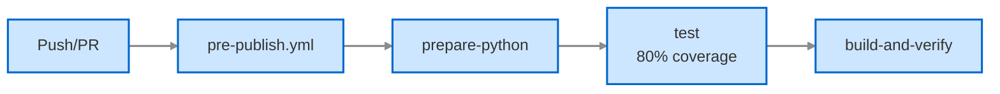

**Development Publishing (Main Branch Only):**

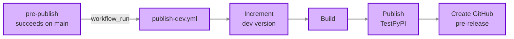

**Production Release (Manual):**

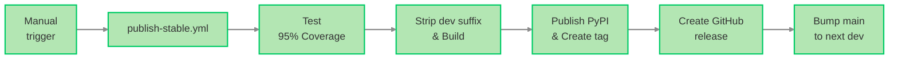

**Architecture benefits:**
- No race conditions (validation completes before publishing)
- No duplicate work (validation runs once, publishing uses results)
- Clear separation of concerns (validate vs publish)
- Automatic gating (failed validation prevents publishing)
- Manual override preserved (workflow_dispatch for emergencies)

### Pre-Publish Validation Workflow

**File:** `.github/workflows/pre-publish.yml`

Validates code quality on all branch pushes and pull requests:

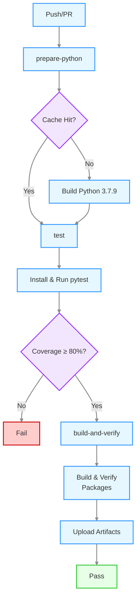

**Workflow execution:**

1. **Prepare Python** (`pre-publish.yml` job: "prepare-python")
   - Checks for cached Python 3.7.9 build
   - Cache key includes Python version and requirements hash
   - Builds Python from source if cache miss (~5-10 minutes)
   - Stores Python and pip cache for reuse

2. **Test** (`pre-publish.yml` job: "test")
   - Restores Python from cache
   - Installs project with development dependencies
   - Runs pytest with 80% coverage requirement
   - Fails if coverage below threshold
   - Generates coverage report

3. **Build and verify** (`pre-publish.yml` job: "build-and-verify")
   - Builds wheel and source distribution
   - Verifies METADATA file contents
   - Checks Python version requirements (>=3.7,<4)
   - Uploads build artifacts with upload-artifact@v4

4. **Update changelog** (`pre-publish.yml` job: "update-changelog")
   - Extracts CHANGES sections from plan files in `features/`
   - Updates CHANGELOG.md with changes for current version
   - Commits with [skip ci] if changes detected
   - Runs on all branches (not just feature/bugfix)

**Triggers:**
- Push to any branch
- Pull requests to main

**Actions:**
- Validates code quality on all branches
- Prevents broken code from being merged
- Provides fast feedback to developers
- Stores build artifacts for potential publishing

### Publish Dev Workflow

**File:** `.github/workflows/publish-dev.yml`

Automatically publishes development versions to TestPyPI when validation succeeds on main branch.

**Workflow trigger:**

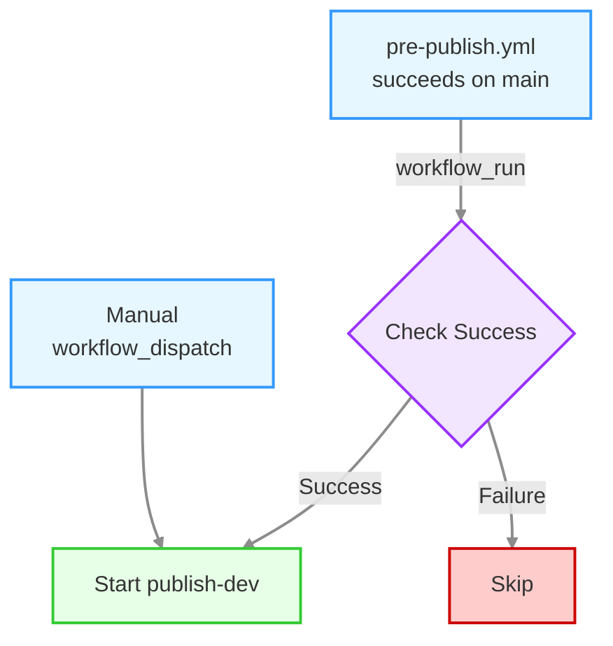

**Trigger logic** (`publish-dev.yml`):
- Workflow run completion: waits for Pre-Publish Validation workflow to complete on main branch
- Only starts if pre-publish succeeded (`conclusion == 'success'`)
- Manual dispatch: allows emergency overrides (bypasses pre-publish check)

**This ensures:**
- No race conditions (pre-publish completes before publishing)
- Failed validation prevents publishing (automatic gating)
- Manual override preserved (emergency deployments)

#### Publication Flow

```mermaid
flowchart LR
    A["Pre-publish<br/>Success"] --> B["Get Version"]
    B --> C["Increment<br/>devN"]
    C --> D["Update<br/>setup.cfg"]
    D --> E["Commit & Push<br/>(skip ci)"]
    E --> F["Create & Push<br/>Tag"]
    F --> G["Build"]
    G --> H["Publish<br/>TestPyPI"]
    H --> I["Create Release<br/>& Notes"]
    I --> J["Complete"]
    
    classDef processStyle fill:#e6f7ff,stroke:#3399ff,stroke-width:2px,color:#333
    classDef versionStyle fill:#f2e6ff,stroke:#9933ff,stroke-width:2px,color:#333
    classDef gitStyle fill:#fff9c4,stroke:#f57f17,stroke-width:2px,color:#333
    classDef publishStyle fill:#e6ffe6,stroke:#33cc33,stroke-width:2px,color:#333
    classDef successStyle fill:#b3e6b3,stroke:#00cc66,stroke-width:2px,color:#333
    
    class A,G processStyle
    class B,C,D versionStyle
    class E,F gitStyle
    class H,I publishStyle
    class J successStyle
    
    linkStyle default stroke:#8c8c8c,stroke-width:2px
```

**Publication execution:**

1. **Version calculation** (`publish-dev.yml` job: "get_version")
   - Reads current version from `setup.cfg` (e.g., `1.2.0.dev5`)
   - Increments dev counter (e.g., `1.2.0.dev5` → `1.2.0.dev6`)

2. **Version update** (`publish-dev.yml` job: "prepare_release")
   - Updates `setup.cfg` with new version
   - Commits change with `[skip ci]` to avoid triggering pre-publish again
   - Pushes directly to main branch

3. **Tagging** (`publish-dev.yml` job: "prepare_release")
   - Creates annotated tag (e.g., `v1.2.0.dev6`)
   - Pushes tag to repository

4. **Package build** (`publish-dev.yml` job: "build")
   - Builds wheel and source distribution
   - Verifies package structure

5. **Publication** (`publish-dev.yml` job: "publish")
   - Publishes to test.pypi.org using Trusted Publisher authentication
   - Uses PyPI API token from GitHub secrets

6. **GitHub release** (`publish-dev.yml` job: "post_release")
   - Generates release notes from plan files
   - Creates GitHub pre-release (marked with pre-release flag)
   - Includes TestPyPI installation instructions

**Triggers:**
- Automatic: When pre-publish completes successfully on main
- Manual: workflow_dispatch (for emergency overrides)

**Actions:**
- Increments dev version (.devN suffix)
- Builds and publishes to TestPyPI
- Creates GitHub pre-release with installation instructions
- Commits version bump with [skip ci]

### Publish Stable Workflow

**File:** `.github/workflows/publish-stable.yml`

Manually triggered production releases to PyPI.

#### Production Release Flow

```mermaid
flowchart LR
    A["Manual Trigger"] --> B["Test<br/>95% Coverage"]
    B --> C["Strip devN<br/>Suffix"]
    C --> D["Build & Publish<br/>to PyPI"]
    D --> E["Create Tag<br/>& Release"]
    E --> F["Bump Main<br/>to Next Dev"]
    F --> G["Complete"]
    
    classDef processStyle fill:#e6f7ff,stroke:#3399ff,stroke-width:2px,color:#333
    classDef versionStyle fill:#f2e6ff,stroke:#9933ff,stroke-width:2px,color:#333
    classDef publishStyle fill:#e6ffe6,stroke:#33cc33,stroke-width:2px,color:#333
    classDef successStyle fill:#b3e6b3,stroke:#00cc66,stroke-width:2px,color:#333
    
    class A,B processStyle
    class C,F versionStyle
    class D,E publishStyle
    class G successStyle
    
    linkStyle default stroke:#8c8c8c,stroke-width:2px
```

**Production release execution:**

The stable release workflow consists of three jobs:

1. **prepare-stable-release** - Restores Python from cache, runs tests with 95% coverage requirement, strips dev suffix, updates README links, creates release branch
2. **publish** - Builds packages, publishes to PyPI, creates git tag, generates release notes, creates GitHub release
3. **post-release** - Bumps main branch to next development version

See [Detailed Steps](#detailed-steps) section below for complete information.

**Triggers:**
- Manual: workflow_dispatch only

**Actions:**
- Strips dev suffix from version
- Runs tests with 95% coverage requirement
- Builds and publishes to production PyPI
- Creates GitHub release with full release notes
- Bumps main to next development version
- Commits all version changes with [skip ci]

**Purpose:** Production releases require manual approval and higher quality standards.

## Prerequisites

[⬆ Back to Top](#table-of-contents)

Before creating a release, ensure:

1. All changes for the release are merged to `main`
2. All tests are passing on `main`
3. PyPI Trusted Publisher is configured for this repository (see [Configuration](#configuration) below)
4. `CHANGELOG.md` is up to date (automatically maintained by pre-publish workflow)

## Creating a Release

[⬆ Back to Top](#table-of-contents)

Stable releases are created manually using GitHub Actions:

1. Go to the **Actions** tab in the GitHub repository
2. Select the **Stable Release** workflow from the left sidebar
3. Click **Run workflow** button
4. Select the `main` branch (should be selected by default)
5. Click **Run workflow** to start the release process

The stable release workflow:
- Runs tests with 95% coverage requirement
- Strips dev suffix from version (e.g., `1.2.0.dev6` → `1.2.0`)
- Publishes to production PyPI
- Creates annotated git tag
- Creates GitHub Release (full release)
- Bumps main to next development version (e.g., `1.2.1.dev0`)

## Development Releases

[⬆ Back to Top](#table-of-contents)

Development releases are automatically published to TestPyPI whenever code is merged to `main` and passes validation.

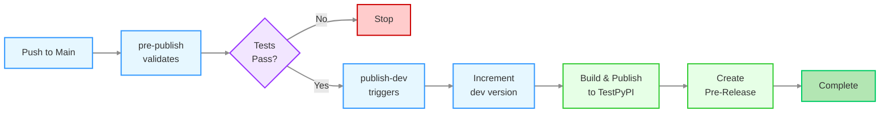

**What happens on merge to main:**

Development releases automatically publish after validation succeeds. The workflow_run trigger ensures no race conditions or duplicate work.

**Execution flow for dev releases:**

1. **Pre-publish validation** (`pre-publish.yml`)
   - Builds Python 3.7.9 (from cache or source)
   - Runs pytest with **80% coverage requirement**
   - Builds and verifies package structure
   - Uploads build artifacts

2. **Publish dev** (`publish-dev.yml` - triggered by pre-publish success)
   - Waits for pre-publish to complete successfully on main
   - Reads current version from `setup.cfg` (e.g., `1.2.0.dev5`)
   - Increments dev counter: `1.2.0.dev5` → `1.2.0.dev6`
   - Updates `setup.cfg` with new version
   - Commits change with `[skip ci]`
   - Pushes directly to main branch
   - Creates tag: `v1.2.0.dev6`
   - Pushes tag to repository
   - Builds wheel and source distribution
   - Publishes to **test.pypi.org** using Trusted Publisher (OIDC)
   - Generates release notes using `generate_dev_release_notes.py` (see [Release Notes Behaviour](#release-notes-behaviour) below)
   - Creates **GitHub pre-release** (marked with pre-release flag)

**Key differences from stable releases:**
- 80% vs 95% coverage threshold
- TestPyPI vs PyPI
- Increments .devN suffix vs strips it
- No release branch created
- Pre-release vs full release
- Version pushed to main immediately

**Accessing development releases:**

- **TestPyPI**: https://test.pypi.org/project/spafw37/
- **GitHub Releases**: Tagged as `vX.Y.Z.devN` and marked as pre-release

**Installing from TestPyPI:**

```bash
pip install --index-url https://test.pypi.org/simple/ --extra-index-url https://pypi.org/simple/ spafw37==1.2.0.dev6
```

**Note:** Development releases are separate from stable releases on PyPI and are automatically cleaned up after 30 days on TestPyPI.

### Release Notes Behaviour

**Script:** `.github/scripts/generate_dev_release_notes.py`

The release notes generation behaves differently for first vs subsequent development releases:

**First dev release** (e.g., `v1.2.0.dev1`):
- Checks if version has `.dev` suffix
- Searches for previous releases with same base version
- If no previous releases found: generates **full changelog**
- Aggregates CHANGES from all plan files targeting version 1.2.0
- Includes all issues and changes for the version
- Purpose: Provides complete context for what's in this version

**Subsequent dev releases** (e.g., `v1.2.0.dev2`, `v1.2.0.dev3`, etc.):
- Detects previous dev releases exist
- Generates **issue-specific changelog**
- Extracts changes only from the current PR's associated issue
- Shows incremental changes since last release
- Purpose: Shows what changed in this specific development iteration

**Stable releases** (e.g., `v1.2.0`):
- Always generates **full changelog**
- Aggregates all changes from all plan files targeting the version
- Provides complete release history for production release

This ensures:
- First dev release provides full context
- Subsequent dev releases show incremental progress
- Stable releases provide comprehensive documentation

## Manual Overrides

[⬆ Back to Top](#table-of-contents)

Both development and stable releases support manual triggering via workflow_dispatch:

**Development releases:**
- Go to Actions → Publish Dev
- Click "Run workflow"
- Select main branch
- This bypasses pre-publish validation (use with caution)

**Stable releases:**
- Go to Actions → Stable Release
- Click "Run workflow"
- Select main branch
- Runs full validation (95% coverage) before publishing

**When to use manual triggers:**
- Emergency hotfix deployment
- Republishing after TestPyPI cleanup
- Testing workflow changes
- Recovering from failed automated releases

**Caution:** Manual dev releases bypass validation. Ensure tests pass before triggering manually.

## What Happens During Stable Release

[⬆ Back to Top](#table-of-contents)

**File:** `.github/workflows/publish-stable.yml`

The stable release workflow automates the entire production release process. It is triggered manually and creates a full release with branching, tagging, and PyPI publication.

### Detailed Steps

The stable release process consists of the following jobs in `publish-stable.yml`:

#### Job 1: prepare-stable-release

- Restores Python 3.7.9 from cache (built by pre-publish workflow)
- Runs pytest with **95% coverage requirement** (higher than dev releases)
- Fails entire release if tests don't pass or coverage insufficient

This job performs all git operations to prepare the release:

1. **Strip dev suffix**
   - Reads current version from `setup.cfg` (e.g., `1.0.0.dev9`)
   - Removes `.devN` suffix (e.g., `1.0.0.dev9` → `1.0.0`)
   - Updates `setup.cfg` with stable version
   - Commits with message: "Release v1.0.0 [skip ci]"

2. **Create release branch**
   - Branch name: `release/v1.0.0`
   - Commits setup.cfg and README.md with version and link updates
   - Pushes branch to repository

**Typical duration:** 30-60 seconds (tests) + 10-20 seconds (git operations)

#### Job 2: publish

- Checks out release branch `release/v1.0.0`
- Restores Python build from cache
- Installs build tools (pip, build, wheel)
- Builds wheel: `spafw37-1.0.0-py3-none-any.whl`
- Builds source distribution: `spafw37-1.0.0.tar.gz`
- Publishes to **PyPI** using Trusted Publisher (OIDC)
- Creates git tag `v1.0.0` and pushes it
- Generates release notes using `generate_dev_release_notes.py`
- Creates GitHub Release (full release, not pre-release) with build artifacts
- Typical duration: 20-30 seconds

**Authentication:** Uses GitHub OIDC token (no API key required) - see [PyPI Trusted Publisher](#pypi-trusted-publisher) section.

#### Job 3: post-release

This job handles post-release version bump:

1. **Bump version for next development cycle**
   - Increments patch version: `1.0.0` → `1.0.1`
   - Adds `.dev0` suffix: `1.0.1.dev0`
   - Updates `setup.cfg`
   - Commits with message: "Bump version to next development cycle [skip ci]"
   - Pushes to main branch

**Typical duration:** 10-20 seconds

### Summary of Changes

1. **Runs all tests** - Verifies that all tests pass and coverage meets 95% requirement

2. **Removes development suffix** - Changes version from `X.Y.Z.devN` to `X.Y.Z` in `setup.cfg`

3. **Creates release branch** - Creates a `release/vX.Y.Z` branch with updated README links pointing to the tagged documentation

4. **Updates README links** - Changes all documentation and example links from `/main/` to `/vX.Y.Z/` so the README on the tag points to the correct tagged documentation

5. **Publishes to PyPI** - Builds distribution packages and uploads them using PyPI Trusted Publisher (OIDC authentication, no API token needed)

6. **Creates git tag** - Creates a version tag (e.g., `v1.0.0`) and pushes it

7. **Generates release notes** - Uses `generate_dev_release_notes.py` to create full changelog with PyPI installation instructions

8. **Creates GitHub Release** - Creates a GitHub Release with generated release notes and build artifacts

9. **Bumps development version** - Increments the patch version and adds `.dev0` suffix on `main` (e.g., `1.0.0` → `1.0.1.dev0`)

All commits use `[skip ci]` to avoid triggering validation workflows unnecessarily.

### Version Flow Diagram

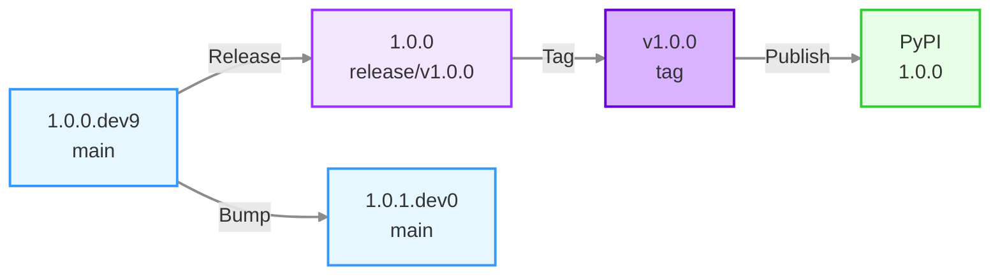

## Post-Release Actions

[⬆ Back to Top](#table-of-contents)

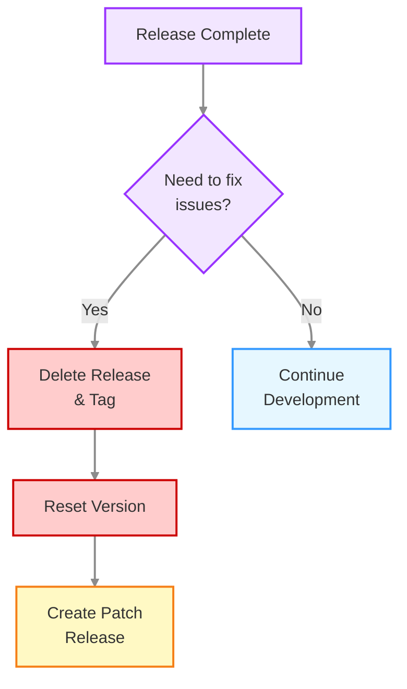

### Rolling Back a Release

If you need to rollback a release due to critical issues:

```mermaid
flowchart LR
    A[Critical Issue Found] --> B[Manual Git Operations]
    B --> C[Delete GitHub Release]
    C --> D[Delete Git Tag]
    D --> E[Delete Release Branch]
    E --> F[Reset Main Version]
    F --> G[⚠ PyPI Cannot Be Deleted]
    G --> H[Create Patch Release<br/>with Fixes]
    
    classDef errorStyle fill:#ffcccc,stroke:#cc0000,stroke-width:2px,color:#333
    classDef processStyle fill:#e6f7ff,stroke:#3399ff,stroke-width:2px,color:#333
    classDef warningStyle fill:#fff9c4,stroke:#f57f17,stroke-width:2px,color:#333
    classDef successStyle fill:#e6ffe6,stroke:#33cc33,stroke-width:2px,color:#333
    
    class A errorStyle
    class B,C,D,E,F processStyle
    class G warningStyle
    class H successStyle
    
    linkStyle default stroke:#8c8c8c,stroke-width:2px
```

**Steps:**

1. Delete the GitHub Release from the repository's Releases page
2. Delete the git tag:
   ```bash
   git tag -d v1.0.0
   git push origin :refs/tags/v1.0.0
   ```
3. Delete the release branch:
   ```bash
   git branch -D release/v1.0.0
   git push origin --delete release/v1.0.0
   ```
4. Reset the main branch version to development (edit `setup.cfg`)
5. Create a bugfix release with the necessary fixes

**Important:** The PyPI package cannot be deleted due to PyPI policy. You must create a new patch release with fixes instead.

## Version Numbering

[⬆ Back to Top](#table-of-contents)

spafw37 uses semantic versioning with development suffixes:

- **Release versions**: `X.Y.Z` (e.g., `1.0.0`, `1.2.3`)
- **Development versions**: `X.Y.Z.devN` (e.g., `1.0.1.dev0`, `1.0.1.dev5`)

The release workflow automatically:
- Removes `.devN` suffix for the release
- Increments the patch version (`Z`) by one after release
- Adds `.dev0` suffix for continued development

## Example Release Cycle

```
1.0.0.dev9        # Current development version
    ↓
1.0.0             # Release workflow removes .dev9
    ↓
[Tagged as v1.0.0 and published to PyPI]
    ↓
[Branch bugfix/1.0.x created from v1.0.0]
    ↓
1.0.1.dev0        # Workflow bumps to next dev version on main
    ↓
1.0.1.dev1        # TestPyPI workflow increments on each push
1.0.1.dev2
...
```

## Bugfix Branches

[⬆ Back to Top](#table-of-contents)

Bugfix branches can be manually created to maintain older release series:

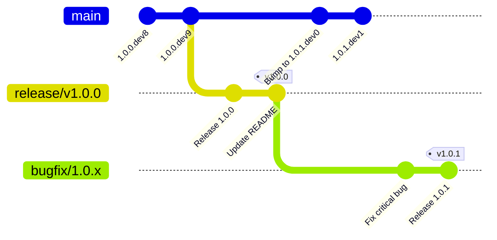

**Branch naming:**
- Release `1.0.0` creates branch `bugfix/1.0.x`
- Release `1.1.0` creates branch `bugfix/1.1.x`
- Release `2.0.0` creates branch `bugfix/2.0.x`

### Using Bugfix Branches

To create a bugfix release (e.g., `1.0.1` after `1.0.0` is released):

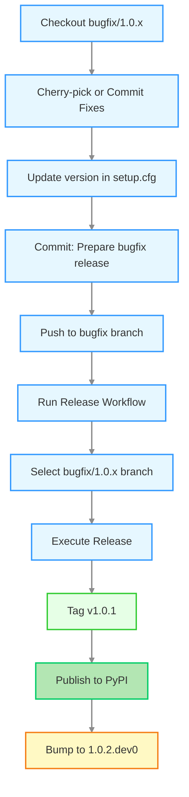

**Commands:**

1. **Cherry-pick or commit fixes** to the bugfix branch:
   ```bash
   git checkout bugfix/1.0.x
   git cherry-pick <commit-hash>
   # or make direct commits
   git commit -m "Fix critical bug"
   ```

2. **Update version** in `setup.cfg` manually:
   ```
   version = 1.0.1
   ```

3. **Commit the version change**:
   ```bash
   git commit -am "Prepare bugfix release 1.0.1 [skip ci]"
   git push origin bugfix/1.0.x
   ```

4. **Run release workflow** targeting the bugfix branch:
   - Go to Actions → Release → Run workflow
   - Select the `bugfix/1.0.x` branch (not main)
   - Click Run workflow

The workflow will:
- Tag as `v1.0.1`
- Publish to PyPI
- Update changelog
- Bump version to `1.0.2.dev0` on the bugfix branch

### When to Use Bugfix Branches

- Critical security fixes for older releases
- Bug fixes for production deployments not yet on latest version
- Maintaining multiple supported versions

**Note**: Regular development continues on `main`. Only use bugfix branches for patch releases to older versions.

## Manual Version Management

[⬆ Back to Top](#table-of-contents)

If you need to do a minor or major version bump instead of patch:

1. Manually edit `setup.cfg` before running the release workflow
2. Change version to desired release version (e.g., `1.1.0` or `2.0.0`)
3. Commit and push: `git commit -am "Prepare for X.Y.Z release [skip ci]"`
4. Run the release workflow as normal

The workflow will use whatever version is in `setup.cfg` (minus any `.dev` suffix) as the release version.

## Changelog Format

[⬆ Back to Top](#table-of-contents)

The `CHANGELOG.md` is automatically maintained during development and releases:

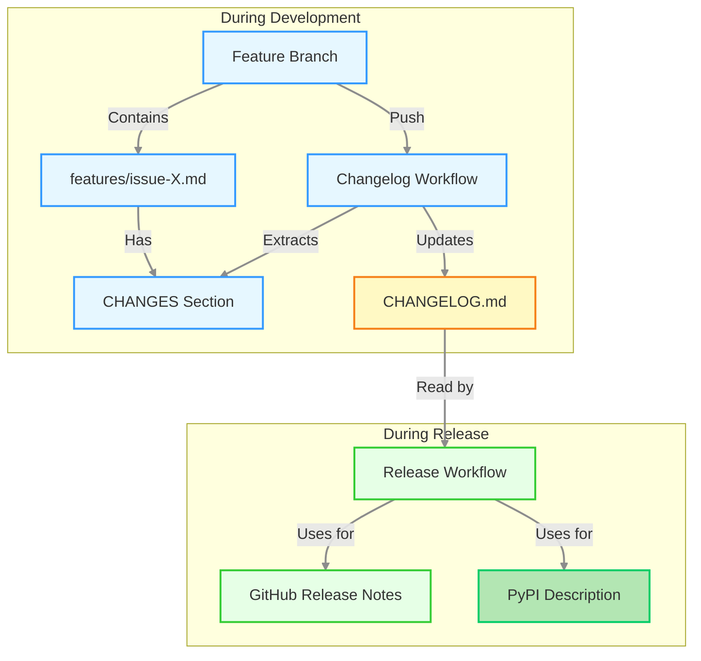

### Changelog Structure

The changelog is organized by version with sections grouped by issue:

```markdown
# Changelog

## [1.1.0] - 2025-11-24

### Issues Closed

- #26: Add Parameter Unset Capability
- #27: Pivot from Config Focus to Param Focus
- #33: Param Allowed Values

### Additions

**Issue #26:**

- `unset_param()` removes parameter value completely from configuration
- `reset_param()` restores parameter to default value
- `PARAM_IMMUTABLE` constant marks parameter as write-once

**Issue #27:**

- `get_param()` retrieves parameter value with automatic type conversion
- `set_param()` stores parameter value after validation
- `join_param()` adds to existing parameter value

### Changes

**Issue #26:**

- `set_param()` now checks immutability before modifications

**Issue #27:**

- Parameter getters consolidated to single `get_param()` function
- Parameter setters split into `set_param()` and `join_param()`

### Documentation

**Issue #26:**

- `doc/parameters.md` added section on unsetting and resetting parameters
- `examples/params_unset.py` demonstrates parameter lifecycle

**Issue #27:**

- `doc/parameters.md` added parameter API section
- `doc/api-reference.md` added Parameter API section
```

### Generation Process

1. **Automatic Extraction** - The changelog workflow extracts CHANGES sections from plan files in `features/`

2. **Organization by Issue** - Each section groups items by issue number for clarity

3. **Stat Line Filtering** - Statistical summary lines (e.g., "11 parameter examples changed") are automatically removed

4. **Version Targeting** - Plan files are matched to versions by:
   - Version in filename (e.g., `issue-26-param-1.1.0.md`)
   - Version in CHANGES header (e.g., `## CHANGES for v1.1.0 Release`)

### Manual Changelog Updates

While the changelog is automatically generated, you can manually edit it if needed:

1. Edit `CHANGELOG.md` directly
2. The next automatic generation will replace the version entry
3. To preserve manual edits, remove the plan files for that version from `features/`

## Troubleshooting

[⬆ Back to Top](#table-of-contents)

### Release Workflow Fails

If the release workflow fails:

1. Check the workflow logs in the Actions tab to identify the failure point
2. Common issues:
   - **Tests failing** - Fix tests and retry
   - **Permission issues** - Check repository permissions (Settings → Actions → General → Workflow permissions)
   - **upload-artifact version** - Ensure using upload-artifact@v4 (v3 was deprecated January 30, 2025)
   - **PyPI Trusted Publisher** - Ensure Trusted Publisher is configured correctly (see [PyPI Trusted Publisher](#pypi-trusted-publisher) section)

### Development Release Not Triggering

If publish-dev doesn't run after merging to main:

1. Check pre-publish workflow completed successfully
   - `publish-dev` only triggers when `pre-publish` succeeds on main
   - Check Actions tab for pre-publish status
2. If pre-publish failed:
   - Fix the issue and push again
   - Or manually trigger publish-dev via workflow_dispatch (bypasses pre-publish check)

### Version Already Published

If you try to publish a version that already exists on PyPI:

1. The workflow will fail at the PyPI upload step
2. You cannot overwrite existing PyPI versions
3. Manually increment the version in `setup.cfg` and retry

### Rollback a Release

To rollback a release:

1. The PyPI package cannot be deleted (PyPI policy)
2. Create a new patch release with fixes
3. You can delete the GitHub Release and tag if needed:
   ```bash
   git tag -d v1.0.0
   git push origin :refs/tags/v1.0.0
   ```

## Configuration

[⬆ Back to Top](#table-of-contents)

### PyPI Trusted Publisher

This project uses **PyPI Trusted Publisher** for secure, token-free publishing:

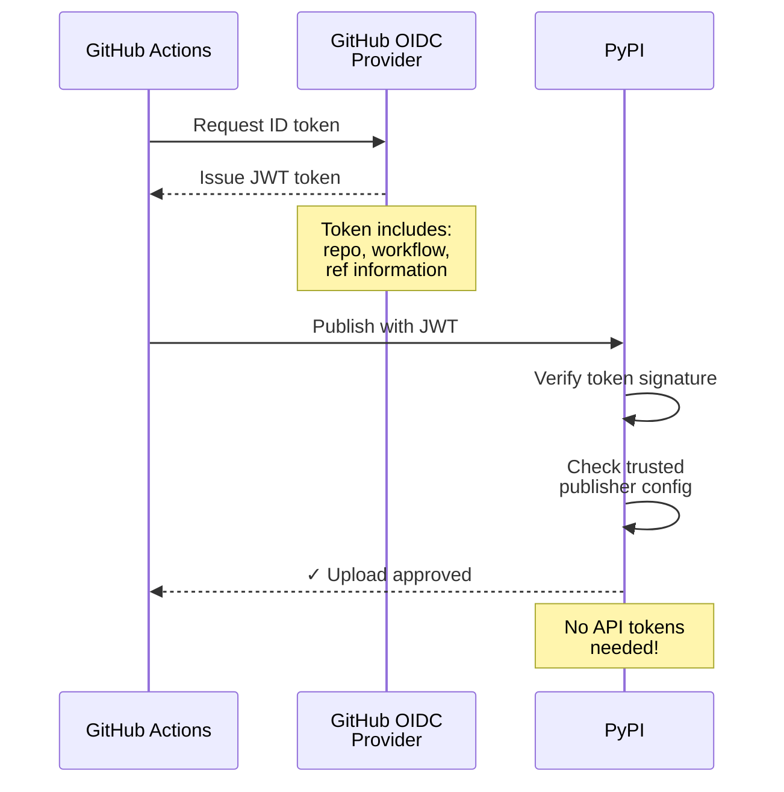

**How it works:**
1. GitHub Actions requests an OpenID Connect (OIDC) token
2. The token contains repository and workflow information
3. PyPI verifies the token and checks trusted publisher configuration
4. If configuration matches, upload is approved

**Setup** (one-time configuration):

1. Go to PyPI project settings: <https://pypi.org/manage/project/spafw37/settings/publishing/>
2. Add "Trusted Publishers" for both release workflows:
   
   **For stable releases (PyPI):**
   - **Owner**: `minouris`
   - **Repository name**: `spafw37`
   - **Workflow name**: `publish-stable.yml`
   - **Environment name**: (leave blank)
   
   **For dev releases (TestPyPI):**
   - Go to TestPyPI project settings: <https://test.pypi.org/manage/project/spafw37/settings/publishing/>
   - **Owner**: `minouris`
   - **Repository name**: `spafw37`
   - **Workflow name**: `publish-dev.yml`
   - **Environment name**: (leave blank)
   
3. Save the configurations

**Benefits**:
- No API tokens to manage or rotate
- More secure (scoped to specific workflow)
- Automatic authentication via OIDC
- No secrets to configure in GitHub

### Workflow Permissions

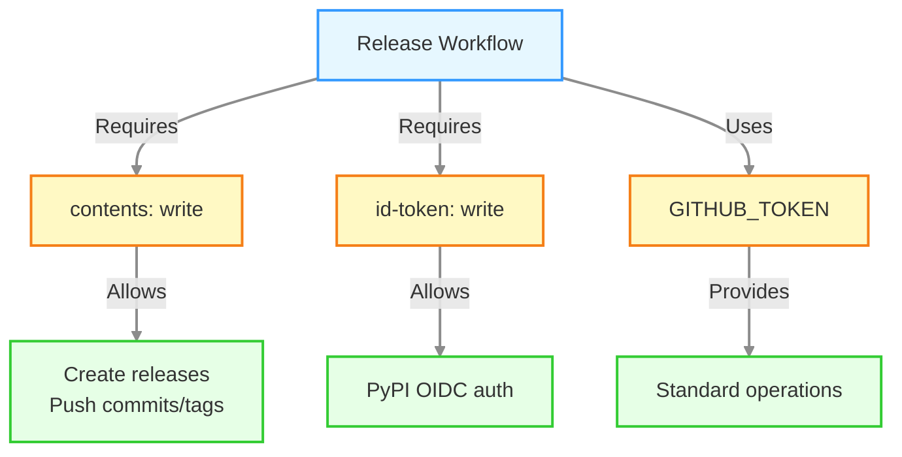

All release workflows require:
- `contents: write` - For creating releases and pushing commits/tags
- `id-token: write` - For PyPI Trusted Publisher OIDC authentication
- Standard `GITHUB_TOKEN` permissions for other operations

### GitHub Secrets

The following secrets can be configured in repository settings:

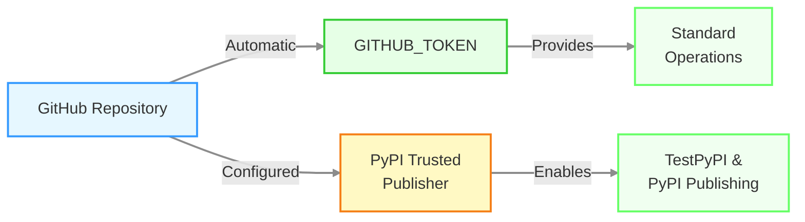

- `GITHUB_TOKEN` - Automatically provided by GitHub Actions for standard operations
- **PyPI Trusted Publisher** - Configured via PyPI/TestPyPI web interface (no tokens needed)
  - See [PyPI Trusted Publisher](#pypi-trusted-publisher) section for setup instructions
