# Release Process

[← Back to Main README](../README.md)

This document describes the release process for spafw37, including continuous integration workflows, automated testing, changelog generation, and deployment to PyPI.

## Table of Contents

- [Overview](#overview)
- [Continuous Integration Workflows](#continuous-integration-workflows)
  - [Workflow Architecture](#workflow-architecture)
  - [Test Workflow](#test-workflow)
  - [Development Release Workflow](#development-release-workflow)
  - [Changelog Generation Workflow](#changelog-generation-workflow)
- [Prerequisites](#prerequisites)
- [Creating a Release](#creating-a-release)
- [Development Releases](#development-releases)
- [Dry-Run Mode](#dry-run-mode)
- [What Happens During Stable Release](#what-happens-during-stable-release)
  - [Detailed Steps](#detailed-steps)
  - [Version Flow Diagram](#version-flow-diagram)
- [Post-Release Actions](#post-release-actions)
  - [Rolling Back a Release](#rolling-back-a-release)
- [Version Numbering](#version-numbering)
  - [Example Release Cycle](#example-release-cycle)
- [Bugfix Branches](#bugfix-branches)
  - [Using Bugfix Branches](#using-bugfix-branches)
  - [When to Use Bugfix Branches](#when-to-use-bugfix-branches)
- [Manual Version Management](#manual-version-management)
- [Changelog Format](#changelog-format)
  - [Changelog Structure](#changelog-structure)
  - [Generation Process](#generation-process)
  - [Manual Changelog Updates](#manual-changelog-updates)
- [Troubleshooting](#troubleshooting)
  - [Release Workflow Fails](#release-workflow-fails)
  - [Version Already Published](#version-already-published)
  - [Rollback a Release](#rollback-a-release)
- [Configuration](#configuration)
  - [PyPI Trusted Publisher](#pypi-trusted-publisher)
  - [Workflow Permissions](#workflow-permissions)
  - [GitHub Secrets](#github-secrets)

## Overview

[⬆ Back to Top](#table-of-contents)

spafw37 uses an automated release system with two types of releases:

- **Development Releases** - Automatically published to TestPyPI on every push to `main`. Tagged as `vX.Y.Z.devN` and marked as pre-releases on GitHub.
- **Stable Releases** - Manually triggered production releases published to PyPI. Tagged as `vX.Y.Z` with full release branches and bugfix branch creation.

Both release types use a unified workflow architecture where launcher workflows (`release-dev.yml` and `release-stable.yml`) call a single shared implementation (`release-common.yml`) with different parameters.

See the [Workflow Architecture](#workflow-architecture) section for detailed workflow descriptions.

## Continuous Integration Workflows

[⬆ Back to Top](#table-of-contents)

spafw37 uses several automated workflows for testing, deployment, and changelog management.

### Workflow Architecture

The release process uses a unified architecture where two launcher workflows call a single shared implementation:

#### Workflow Files Overview

**Launcher Workflows:**

- **`release-dev.yml`** - Development Release Launcher
  - **Triggers**: Push to `main` (live), pull requests to `main` (preview), manual dispatch
  - **Purpose**: Publishes development versions to TestPyPI for testing
  - **Behaviour**: Automatically determines dry-run mode (false for main pushes, true for PRs)
  - **Parameters passed to unified workflow**:
    - Coverage: 80%
    - Publish target: TestPyPI
    - Version operation: increment-dev (bumps .devN suffix)
    - Branching: disabled
    - GitHub release: pre-release only

- **`release-stable.yml`** - Stable Release Launcher
  - **Triggers**: Manual workflow dispatch only
  - **Purpose**: Publishes production releases to PyPI
  - **Behaviour**: Accepts dry-run parameter for preview mode
  - **Parameters passed to unified workflow**:
    - Coverage: 95%
    - Publish target: PyPI
    - Version operation: strip-dev (removes .devN suffix)
    - Branching: creates release and bugfix branches
    - GitHub release: full release

**Core Workflows:**

- **`release-common.yml`** - Unified Release Implementation
  - **Type**: Reusable workflow (workflow_call)
  - **Purpose**: Single source of truth for all release operations
  - **Jobs**: prepare-python, test, get_version, prepare_release, build_and_verify, publish, post_release
  - **Parameterised**: Accepts 9 inputs to control behaviour
  - **Used by**: Both release-dev.yml and release-stable.yml

**Supporting Workflows:**

- **`build-python.yml`** - Python Build
  - **Type**: Reusable workflow
  - **Purpose**: Builds Python 3.7.9 from source with caching
  - **Used by**: release-common.yml, test.yml, build-and-verify.yml
  - **Caching**: Stores built Python and pip cache for reuse

- **`test.yml`** - Test Suite
  - **Triggers**: Push/PR to main/develop branches, or called by other workflows
  - **Purpose**: Runs pytest with coverage enforcement
  - **Configurable**: Coverage threshold (80% or 95%)
  - **Used by**: release-common.yml, and runs independently on all pushes

- **`build-and-verify.yml`** - Package Build and Verification
  - **Type**: Reusable workflow
  - **Purpose**: Builds wheel and source distribution, validates package structure
  - **Verification**: Checks METADATA file, Python version requirements
  - **Used by**: release-common.yml

- **`update-changelog.yml`** - Automatic Changelog Generation
  - **Triggers**: Push to feature/** or bugfix/** branches
  - **Purpose**: Extracts CHANGES sections from plan files and updates CHANGELOG.md
  - **Dependencies**: Waits for Test and Packaging workflows to succeed
  - **Behaviour**: Commits updated changelog with [skip ci]

**Workflow Call Hierarchy:**

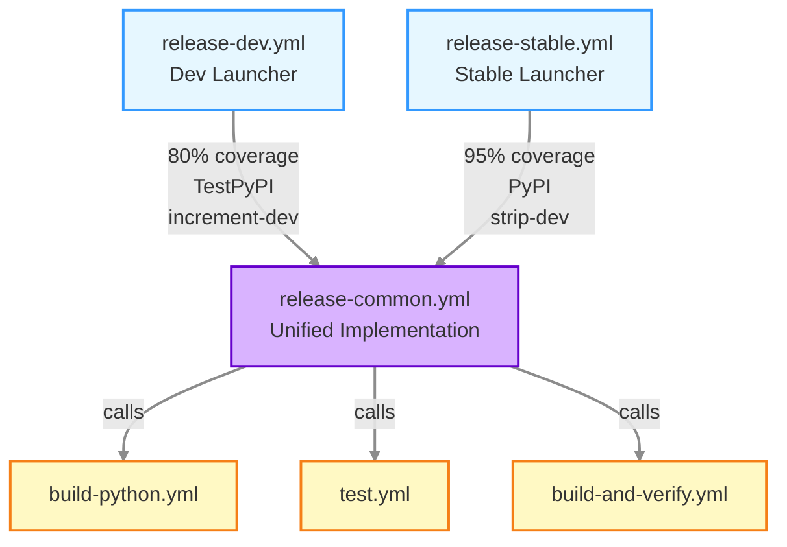

**Benefits of unified architecture:**
- Single source of truth for release logic
- Consistent behaviour between dev and stable releases
- Easier to maintain and test
- Clear separation between launcher and implementation
- Parameterisation allows for flexible release strategies

### Test Workflow

**File:** `.github/workflows/test.yml`

Runs on every push and pull request to verify code quality:

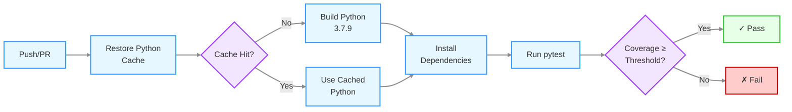

**Workflow execution:**

1. **Cache restoration** (`test.yml` step: "Restore Python build & pip caches")
   - Checks for cached Python 3.7.9 build
   - Cache key includes Python version and requirements.txt hash
   - Significantly speeds up subsequent runs

2. **Python installation** (`test.yml` step: "Install build dependencies")
   - Only runs on cache miss
   - Downloads Python 3.7.9 source from python.org
   - Compiles and installs to local directory
   - Takes ~5-10 minutes on first run

3. **Dependency installation** (`test.yml` step: "Install dependencies")
   - Installs project in editable mode with dev dependencies
   - Uses pip with cached packages when available

4. **Test execution** (`test.yml` step: "Run tests with pytest")
   - Runs pytest with coverage tracking
   - Coverage threshold: 80% (default) or 95% (stable releases)
   - Fails if coverage below threshold
   - Generates coverage report

**Triggers:**
- Push to `main` or `develop` branches
- Pull requests to `main` or `develop` branches
- Manual workflow dispatch
- Called by `release-common.yml`

**Actions:**
- Builds Python 3.7.9 from source with caching
- Installs project with development dependencies
- Runs pytest with configurable coverage requirement (80% for dev releases, 95% for stable releases)
- Reports test results and coverage

### Development Release Workflow

**File:** `.github/workflows/release-dev.yml`

Automatically publishes development versions to TestPyPI on every push to `main`, and provides dry-run preview on pull requests.

#### Dry-Run Determination

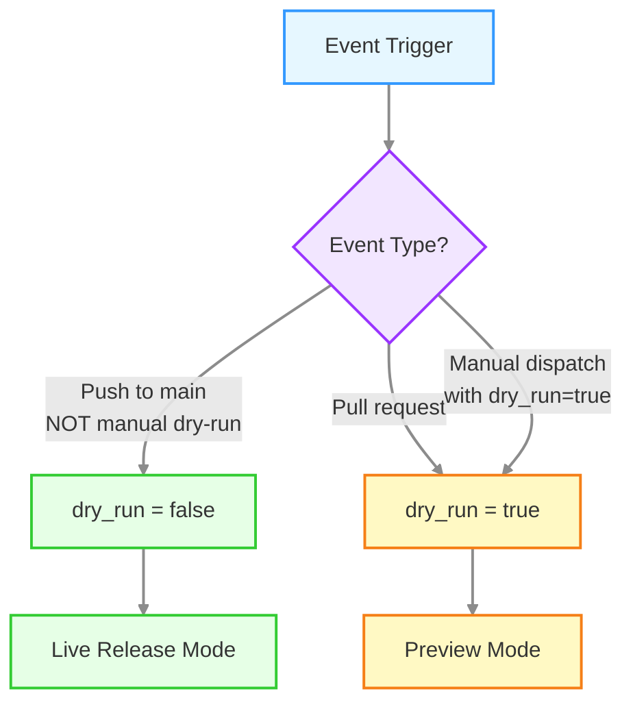

**Dry-run logic** (`release-dev.yml` job: "set_dry_run"):
- Push to main branch: dry_run = false (live release)
- Pull request to main: dry_run = true (preview only)
- Manual dispatch with dry_run input: uses provided value

#### Live Release Flow

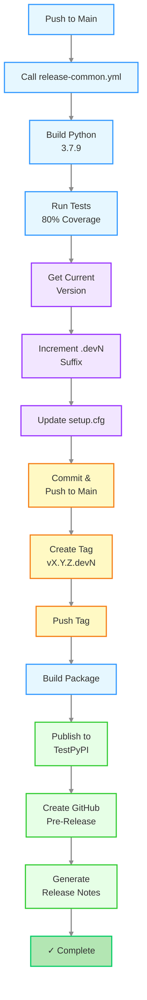

**Live release execution** (dry_run = false):

1. **Python build** (`release-common.yml` job: "prepare-python")
   - Calls `build-python.yml` to ensure Python 3.7.9 is available
   - Uses cached build if available

2. **Testing** (`release-common.yml` job: "test")
   - Calls `test.yml` with 80% coverage threshold
   - Fails release if tests don't pass

3. **Version calculation** (`release-common.yml` job: "get_version")
   - Reads current version from `setup.cfg` (e.g., `1.2.0.dev5`)
   - Increments dev counter (e.g., `1.2.0.dev5` → `1.2.0.dev6`)

4. **Version update** (`release-common.yml` job: "prepare_release")
   - Updates `setup.cfg` with new version
   - Commits change with `[skip ci]`
   - Pushes directly to main branch

5. **Tagging** (`release-common.yml` job: "prepare_release")
   - Creates annotated tag (e.g., `v1.2.0.dev6`)
   - Pushes tag to repository

6. **Package build** (`release-common.yml` job: "build_and_verify")
   - Calls `build-and-verify.yml` to build wheel and source distribution
   - Verifies package metadata
   - Uploads artifacts for publication

7. **Publication** (`release-common.yml` job: "publish")
   - Downloads built package artifacts
   - Publishes to test.pypi.org using Trusted Publisher authentication

8. **GitHub release** (`release-common.yml` job: "post_release")
   - Generates release notes from plan files
   - Creates GitHub pre-release (marked with pre-release flag)
   - Includes TestPyPI installation instructions

#### Preview Mode Flow

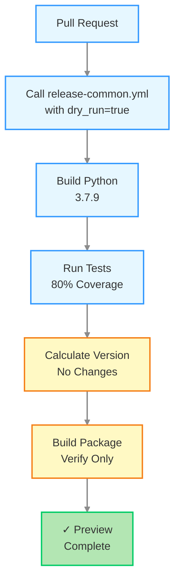

**Preview mode execution** (dry_run = true):

1. **Testing** - Same as live mode
2. **Version calculation** - Calculates what version would be, but doesn't update files
3. **Package build** - Builds package to verify it can be built successfully
4. **Skipped operations**:
   - No commits or pushes to repository
   - No tag creation
   - No publication to TestPyPI
   - No GitHub release creation

**Purpose:** Validates that the release workflow would succeed without making any changes.

**Triggers:**
- Push to `main` branch (live release)
- Pull requests to `main` branch (dry-run preview)

**Actions:**
1. Determines dry-run mode based on event type
2. Calls unified release workflow with dev parameters:
   - Coverage threshold: 80%
   - Publish target: TestPyPI
   - Version operation: increment-dev (.devN suffix)
   - No branching operations
3. In live mode: publishes to TestPyPI and creates GitHub pre-release
4. In dry-run mode: validates build without publishing

**Purpose:** Provides continuous deployment for testing development versions with preview capability.

### Changelog Generation Workflow

**File:** `.github/workflows/update-changelog.yml`

Automatically updates `CHANGELOG.md` when feature/bugfix branches are pushed.

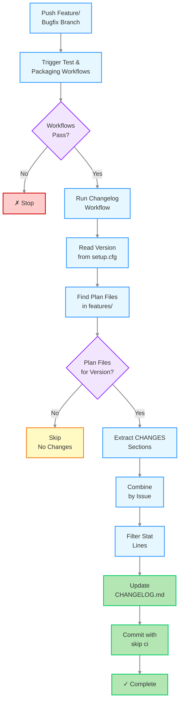

**Workflow execution:**

1. **Trigger** (`update-changelog.yml` trigger: "workflow_run")
   - Waits for Test and Packaging workflows to complete
   - Only runs if both workflows succeeded
   - Triggered by pushes to `feature/**` or `bugfix/**` branches

2. **Version detection** (`update-changelog.yml` step: "Generate changelog" → `generate_changelog.py`)
   - Reads current development version from `setup.cfg`
   - Example: `1.2.0.dev5` → target version `1.2.0`

3. **Plan file discovery** (`generate_changelog.py`)
   - Searches `features/` directory for plan files
   - Matches by filename pattern: `issue-*-<version>.md`
   - Also checks CHANGES section headers for version match

4. **Content extraction** (`generate_changelog.py`)
   - Extracts CHANGES sections from each plan file
   - Groups changes by issue number
   - Preserves section structure (Additions, Changes, Fixes, etc.)

5. **Filtering** (`generate_changelog.py`)
   - Removes statistical summary lines (e.g., "11 parameter examples changed")
   - Keeps only user-relevant changes

6. **Update CHANGELOG.md** (`generate_changelog.py`)
   - Updates or replaces the version entry
   - Maintains chronological order (newest first)
   - Follows CHANGES-TEMPLATE.md format

7. **Commit** (`update-changelog.yml` step: "Commit and push changelog")
   - Commits updated CHANGELOG.md
   - Uses `[skip ci]` to avoid triggering more workflows
   - Pushes directly to the feature/bugfix branch

**Triggers:**
- Push to `feature/**` or `bugfix/**` branches
- After Test and Packaging workflows complete successfully

**Actions:**
1. Reads current development version from `setup.cfg`
2. Finds all plan files in `features/` targeting that version
3. Extracts CHANGES sections from each plan file
4. Combines sections organised by issue number
5. Filters out statistical summary lines
6. Updates or replaces version entry in `CHANGELOG.md`
7. Commits changes with `[skip ci]`

**Purpose:** Keeps changelog current during development without manual consolidation.

## Prerequisites

[⬆ Back to Top](#table-of-contents)

Before creating a release, ensure:

1. All changes for the release are merged to `main`
2. All tests are passing on `main`
3. PyPI Trusted Publisher is configured for this repository (see [Configuration](#configuration) below)
4. `CHANGELOG.md` is up to date (automatically maintained by changelog workflow)

## Creating a Release

[⬆ Back to Top](#table-of-contents)

Stable releases are created manually using GitHub Actions:

1. Go to the **Actions** tab in the GitHub repository
2. Select the **Stable Release** workflow from the left sidebar
3. Click **Run workflow** button
4. Select the `main` branch (should be selected by default)
5. **Optional: Enable dry-run mode** to preview the release without publishing
6. Click **Run workflow** to start the release process

The stable release workflow calls the unified release workflow with production parameters:
- Coverage threshold: 95%
- Publish target: PyPI
- Version operation: strip-dev (removes .devN suffix)
- Creates release branch and bugfix branch
- Creates GitHub Release (not pre-release)

## Development Releases

[⬆ Back to Top](#table-of-contents)

Development releases are automatically published to TestPyPI and GitHub whenever code is pushed to `main`. Pull requests trigger dry-run previews without publishing.

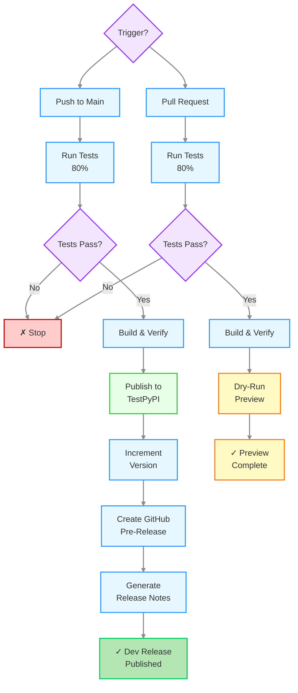

**What happens on push to main (live release):**

Development releases automatically publish to TestPyPI and create GitHub pre-releases. The process uses the same `release-common.yml` workflow as stable releases, but with different parameters.

**Job execution for dev releases:**

1. **Job: prepare-python** (`release-common.yml` → `build-python.yml`)
   - Ensures Python 3.7.9 is available (from cache or built)

2. **Job: test** (`release-common.yml` → `test.yml`)
   - Runs pytest with **80% coverage threshold** (lower than stable releases)
   - Fails release if tests don't pass

3. **Job: get_version** (`release-common.yml`)
   - Reads current version from `setup.cfg` (e.g., `1.2.0.dev5`)
   - Increments dev counter: `1.2.0.dev5` → `1.2.0.dev6`

4. **Job: prepare_release** (`release-common.yml`)
   - Updates `setup.cfg` with new version: `version = 1.2.0.dev6`
   - Commits change with `[skip ci]`
   - **Pushes directly to main branch** (no release branch created)
   - Creates tag: `v1.2.0.dev6`
   - Pushes tag to repository
   - **No bugfix branch created** (only for stable releases)

5. **Job: build_and_verify** (`release-common.yml` → `build-and-verify.yml`)
   - Builds wheel and source distribution
   - Verifies package structure

6. **Job: publish** (`release-common.yml`)
   - Publishes to **test.pypi.org** (not production PyPI)
   - Uses TEST_PYPI_API_TOKEN secret

7. **Job: post_release** (`release-common.yml`)
   - Generates release notes (see [Release Notes Behaviour](#release-notes-behaviour) below)
   - Creates **GitHub pre-release** (marked with pre-release flag)
   - **No version bump** (version already incremented in prepare_release)

**Key differences from stable releases:**
- 80% vs 95% coverage threshold
- TestPyPI vs PyPI
- Increments .devN suffix vs strips it
- No release branch created
- No bugfix branch created
- Pre-release vs full release
- Version pushed to main immediately

**What happens on pull request (dry-run preview):**

1. **Tests run** - Verifies 80% code coverage
2. **Package built** - Creates wheel and source distribution
3. **Build validated** - Ensures package structure is correct
4. **No publishing** - Package is not uploaded to TestPyPI
5. **No git operations** - No commits, tags, or releases created
6. **Preview complete** - Workflow confirms package would build successfully

### Release Notes Behaviour

**Script:** `.github/scripts/generate_dev_release_notes.py`

The release notes generation behaves differently for first vs subsequent development releases:

**First dev release** (e.g., `v1.2.0.dev1`):
- Checks if version has `.dev` suffix
- Searches for previous releases with same base version
- If no previous releases found: generates **full changelog**
- Aggregates CHANGES from all plan files targeting version 1.2.0
- Includes all issues and changes for the version
- Purpose: Provides complete context for what's in this version

**Subsequent dev releases** (e.g., `v1.2.0.dev2`, `v1.2.0.dev3`, etc.):
- Detects previous dev releases exist
- Generates **issue-specific changelog**
- Extracts changes only from the current PR's associated issue
- Shows incremental changes since last release
- Purpose: Shows what changed in this specific development iteration

**Stable releases** (e.g., `v1.2.0`):
- Always generates **full changelog**
- Aggregates all changes from all plan files targeting the version
- Provides complete release history for production release

This ensures:
- First dev release provides full context
- Subsequent dev releases show incremental progress
- Stable releases provide comprehensive documentation

**Accessing development releases:**

- **TestPyPI**: https://test.pypi.org/project/spafw37/
- **GitHub Releases**: Tagged as `vX.Y.Z.devN` and marked as pre-release

**Installing from TestPyPI:**

```bash
pip install --index-url https://test.pypi.org/simple/ --extra-index-url https://pypi.org/simple/ spafw37==1.2.0.dev6
```

**Note:** Development releases are separate from stable releases on PyPI and are automatically cleaned up after 30 days on TestPyPI.

## Dry-Run Mode

[⬆ Back to Top](#table-of-contents)

Both development and stable releases support dry-run mode for previewing releases without publishing:

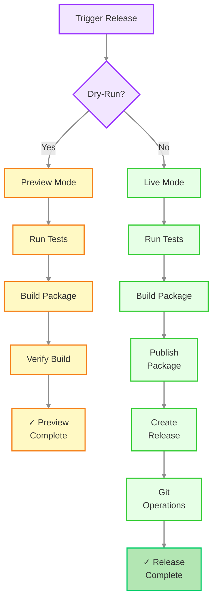

**When to use dry-run:**
- Testing release workflow changes
- Verifying package builds correctly
- Previewing release without publishing
- Development workflow triggered by pull requests (automatic dry-run)

**Dry-run mode skips:**
- Package publication to PyPI/TestPyPI
- Git commits and pushes
- Tag creation
- GitHub Release creation

**Dry-run mode performs:**
- Full test suite execution
- Package build and verification
- All validation checks

## What Happens During Stable Release

[⬆ Back to Top](#table-of-contents)

**File:** `.github/workflows/release-stable.yml` → calls `.github/workflows/release-common.yml`

The stable release workflow automates the entire production release process. It is triggered manually and creates a full release with branching, tagging, and PyPI publication.

### Release Flow Overview

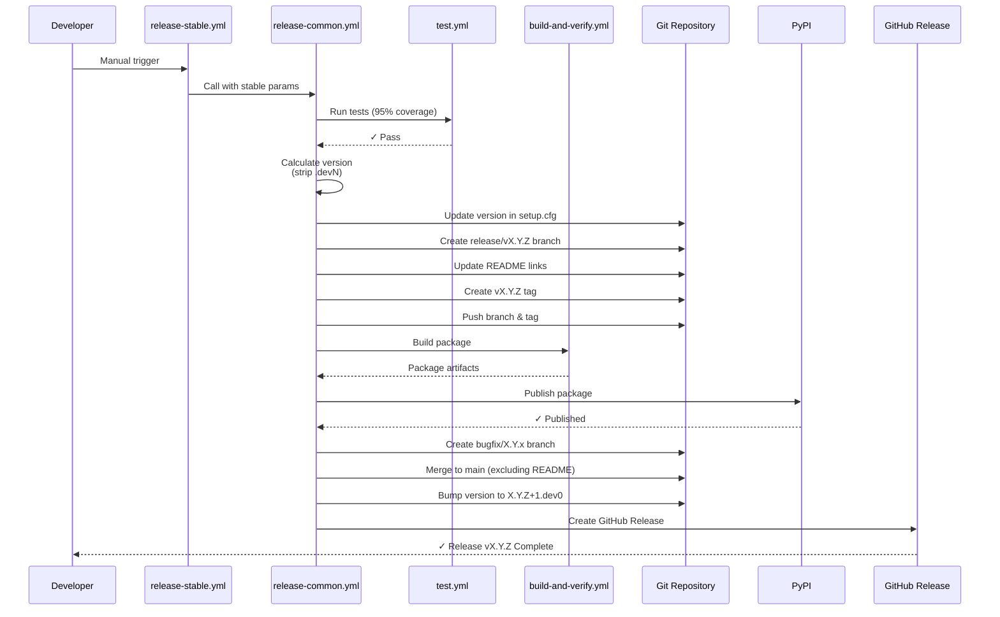

**Stable release parameters passed to release-common.yml:**
- `coverage_threshold: 95` (higher than dev releases)
- `publish_to: 'pypi'` (production PyPI)
- `version_operation: 'strip-dev'` (removes .devN suffix)
- `create_release_branch: true`
- `create_bugfix_branch: true`
- `create_release: true` (GitHub Release, not pre-release)
- `generate_full_changelog: true`

### Detailed Steps

The stable release process consists of 7 jobs in `release-common.yml`, each performing specific tasks:

#### Job 1: prepare-python

**File:** `release-common.yml` job: "prepare-python" → calls `build-python.yml`

- Ensures Python 3.7.9 is available
- Restores from cache if available (~2 seconds)
- Builds from source if cache miss (~5-10 minutes)
- Stores built Python and pip cache for subsequent jobs

#### Job 2: test

**File:** `release-common.yml` job: "test" → calls `test.yml`

- Restores Python build from cache
- Installs project with dev dependencies
- Runs pytest with **95% coverage threshold** (higher than dev releases)
- Fails entire release if tests don't pass or coverage insufficient
- Typical duration: 30-60 seconds (after cache warm)

#### Job 3: get_version

**File:** `release-common.yml` job: "get_version"

- Reads current version from `setup.cfg` (e.g., `1.0.0.dev9`)
- Calculates release version by stripping `.devN` suffix (e.g., `1.0.0`)
- Outputs both current and release versions for subsequent jobs
- Typical duration: <5 seconds

#### Job 4: prepare_release

**File:** `release-common.yml` job: "prepare_release"

This job performs all git operations to prepare the release:

1. **Update version** (`setup.cfg`)
   - Changes `version = 1.0.0.dev9` to `version = 1.0.0`
   - Commits with message: "Release v1.0.0 [skip ci]"

2. **Create release branch**
   - Branch name: `release/v1.0.0`
   - Contains version updates and README link changes

3. **Update README links**
   - Changes `/tree/main/` → `/tree/v1.0.0/`
   - Changes `/blob/main/` → `/blob/v1.0.0/`
   - Ensures README on the tag points to correct tagged documentation

4. **Update changelog** (if `generate_full_changelog: true`)
   - Updates version header from `[1.0.0.dev9]` to `[1.0.0] (2025-11-24)`
   - Adds release date

5. **Create and push tag**
   - Tag name: `v1.0.0`
   - Annotated tag with message: "Release v1.0.0"
   - Pushed to repository

6. **Push release branch**
   - Branch `release/v1.0.0` pushed to repository
   - Contains all version and README updates

7. **Merge to main** (excluding README)
   - Merges version and changelog updates to main
   - Excludes README commit to keep main pointing to `/main/` links
   - Commit message: "Merge release/v1.0.0 to main (version and changelog) [skip ci]"

8. **Create bugfix branch**
   - Branch name: `bugfix/1.0.x` (extracted from version)
   - Created from the release tag
   - Used for future patch releases (1.0.1, 1.0.2, etc.)
   - Pushed to repository

**Typical duration:** 10-20 seconds (mostly git operations)

#### Job 5: build_and_verify

**File:** `release-common.yml` job: "build_and_verify" → calls `build-and-verify.yml`

- Restores Python build from cache
- Installs build tools (pip, setuptools, wheel, build)
- Builds wheel: `spafw37-1.0.0-py3-none-any.whl`
- Builds source distribution: `spafw37-1.0.0.tar.gz`
- Verifies package structure and metadata
- Uploads artifacts for publication job
- Typical duration: 15-30 seconds

#### Job 6: publish

**File:** `release-common.yml` job: "publish"

- Downloads built package artifacts from build_and_verify job
- Installs twine for PyPI upload
- Authenticates using PyPI Trusted Publisher (OIDC)
- Publishes to **PyPI** (pypi.org, not TestPyPI)
- Upload includes both wheel and source distribution
- Typical duration: 5-15 seconds

**Authentication:** Uses GitHub OIDC token (no API key required) - see [PyPI Trusted Publisher](#pypi-trusted-publisher) section.

#### Job 7: post_release

**File:** `release-common.yml` job: "post_release"

This job handles post-release tasks:

1. **Generate release notes**
   - Runs `.github/scripts/generate_dev_release_notes.py`
   - For stable releases: aggregates full changelog from all plan files
   - Formats for GitHub Release display
   - Includes installation instructions

2. **Create GitHub Release**
   - Uses `gh release create` command
   - Title: "Release v1.0.0"
   - Uses generated release notes
   - Creates full release (not pre-release)
   - Attached to tag `v1.0.0`

3. **Bump version for next development cycle**
   - Increments patch version: `1.0.0` → `1.0.1`
   - Adds `.dev0` suffix: `1.0.1.dev0`
   - Updates `setup.cfg`
   - Commits with message: "Bump version to next development cycle [skip ci]"
   - Pushes to main branch

**Typical duration:** 10-20 seconds

### Summary of Changes

1. **Runs all tests** - Verifies that all tests pass and coverage targets are met (95%)

2. **Removes development suffix** - Changes version from `X.Y.Z.devN` to `X.Y.Z` in `setup.cfg`

3. **Creates release branch** - Creates a `release/vX.Y.Z` branch with updated README links pointing to the tagged documentation

4. **Updates README links** - Changes all documentation and example links from `/main/` to `/vX.Y.Z/` so the README on the tag points to the correct tagged documentation

5. **Creates git tag** - Creates a version tag (e.g., `v1.0.0`) from the release branch and pushes it

6. **Creates bugfix branch** - Creates a `bugfix/X.Y.x` branch from the tag for future patch releases

7. **Publishes to PyPI** - Builds distribution packages and uploads them using PyPI Trusted Publisher (OIDC authentication, no API token needed)

8. **Bumps development version** - Increments the patch version and adds `.dev0` suffix on `main` (e.g., `1.0.0` → `1.0.1.dev0`)

9. **Creates GitHub Release** - Creates a GitHub Release with install instructions

All commits use `[skip ci]` to avoid triggering the test workflow unnecessarily.

### Version Flow Diagram

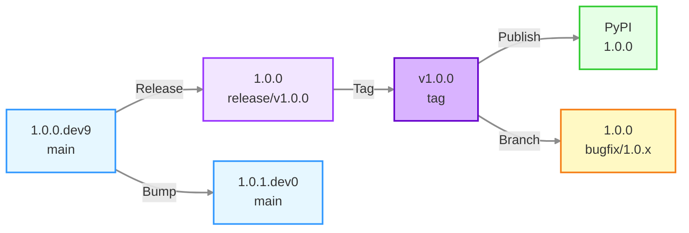

## Post-Release Actions

[⬆ Back to Top](#table-of-contents)

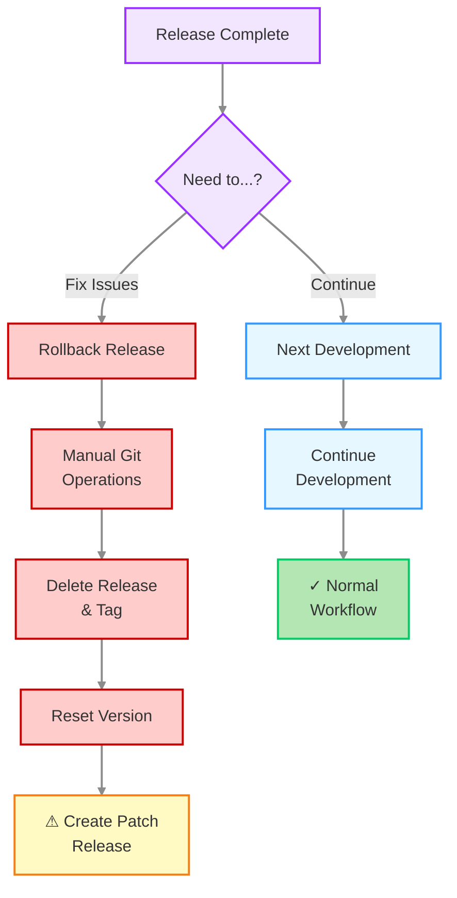

### Rolling Back a Release

If you need to rollback a release due to critical issues:

```mermaid
flowchart LR
    A[Critical Issue Found] --> B[Manual Git Operations]
    B --> C[Delete GitHub Release]
    C --> D[Delete Git Tag]
    D --> E[Delete Release Branch]
    E --> F[Reset Main Version]
    F --> G[⚠ PyPI Cannot Be Deleted]
    G --> H[Create Patch Release<br/>with Fixes]
    
    classDef errorStyle fill:#ffcccc,stroke:#cc0000,stroke-width:2px,color:#333
    classDef processStyle fill:#e6f7ff,stroke:#3399ff,stroke-width:2px,color:#333
    classDef warningStyle fill:#fff9c4,stroke:#f57f17,stroke-width:2px,color:#333
    classDef successStyle fill:#e6ffe6,stroke:#33cc33,stroke-width:2px,color:#333
    
    class A errorStyle
    class B,C,D,E,F processStyle
    class G warningStyle
    class H successStyle
    
    linkStyle default stroke:#8c8c8c,stroke-width:2px
```

**Steps:**

1. Delete the GitHub Release from the repository's Releases page
2. Delete the git tag:
   ```bash
   git tag -d v1.0.0
   git push origin :refs/tags/v1.0.0
   ```
3. Delete the release branch:
   ```bash
   git branch -D release/v1.0.0
   git push origin --delete release/v1.0.0
   ```
4. Reset the main branch version to development (edit `setup.cfg`)
5. Create a bugfix release with the necessary fixes

**Important:** The PyPI package cannot be deleted due to PyPI policy. You must create a new patch release with fixes instead.

## Version Numbering

[⬆ Back to Top](#table-of-contents)

spafw37 uses semantic versioning with development suffixes:

- **Release versions**: `X.Y.Z` (e.g., `1.0.0`, `1.2.3`)
- **Development versions**: `X.Y.Z.devN` (e.g., `1.0.1.dev0`, `1.0.1.dev5`)

The release workflow automatically:
- Removes `.devN` suffix for the release
- Increments the patch version (`Z`) by one after release
- Adds `.dev0` suffix for continued development

## Example Release Cycle

```
1.0.0.dev9        # Current development version
    ↓
1.0.0             # Release workflow removes .dev9
    ↓
[Tagged as v1.0.0 and published to PyPI]
    ↓
[Branch bugfix/1.0.x created from v1.0.0]
    ↓
1.0.1.dev0        # Workflow bumps to next dev version on main
    ↓
1.0.1.dev1        # TestPyPI workflow increments on each push
1.0.1.dev2
...
```

## Bugfix Branches

[⬆ Back to Top](#table-of-contents)

Each release automatically creates a bugfix branch for that release series:

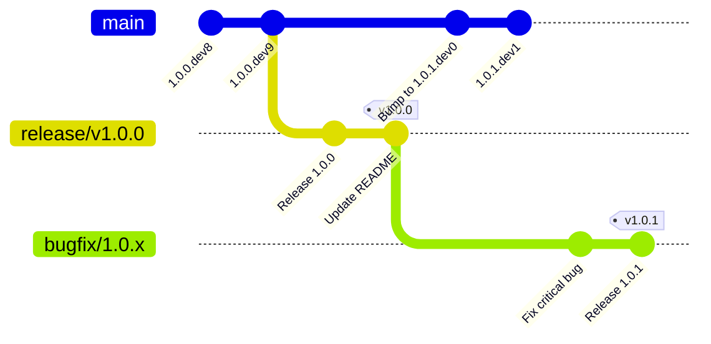

**Branch naming:**
- Release `1.0.0` creates branch `bugfix/1.0.x`
- Release `1.1.0` creates branch `bugfix/1.1.x`
- Release `2.0.0` creates branch `bugfix/2.0.x`

### Using Bugfix Branches

To create a bugfix release (e.g., `1.0.1` after `1.0.0` is released):

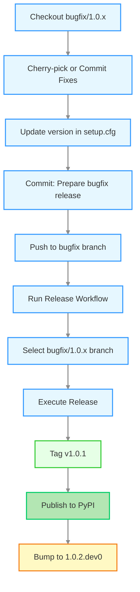

**Commands:**

1. **Cherry-pick or commit fixes** to the bugfix branch:
   ```bash
   git checkout bugfix/1.0.x
   git cherry-pick <commit-hash>
   # or make direct commits
   git commit -m "Fix critical bug"
   ```

2. **Update version** in `setup.cfg` manually:
   ```
   version = 1.0.1
   ```

3. **Commit the version change**:
   ```bash
   git commit -am "Prepare bugfix release 1.0.1 [skip ci]"
   git push origin bugfix/1.0.x
   ```

4. **Run release workflow** targeting the bugfix branch:
   - Go to Actions → Release → Run workflow
   - Select the `bugfix/1.0.x` branch (not main)
   - Click Run workflow

The workflow will:
- Tag as `v1.0.1`
- Publish to PyPI
- Update changelog
- Bump version to `1.0.2.dev0` on the bugfix branch

### When to Use Bugfix Branches

- Critical security fixes for older releases
- Bug fixes for production deployments not yet on latest version
- Maintaining multiple supported versions

**Note**: Regular development continues on `main`. Only use bugfix branches for patch releases to older versions.

## Manual Version Management

[⬆ Back to Top](#table-of-contents)

If you need to do a minor or major version bump instead of patch:

1. Manually edit `setup.cfg` before running the release workflow
2. Change version to desired release version (e.g., `1.1.0` or `2.0.0`)
3. Commit and push: `git commit -am "Prepare for X.Y.Z release [skip ci]"`
4. Run the release workflow as normal

The workflow will use whatever version is in `setup.cfg` (minus any `.dev` suffix) as the release version.

## Changelog Format

[⬆ Back to Top](#table-of-contents)

The `CHANGELOG.md` is automatically maintained during development and releases:

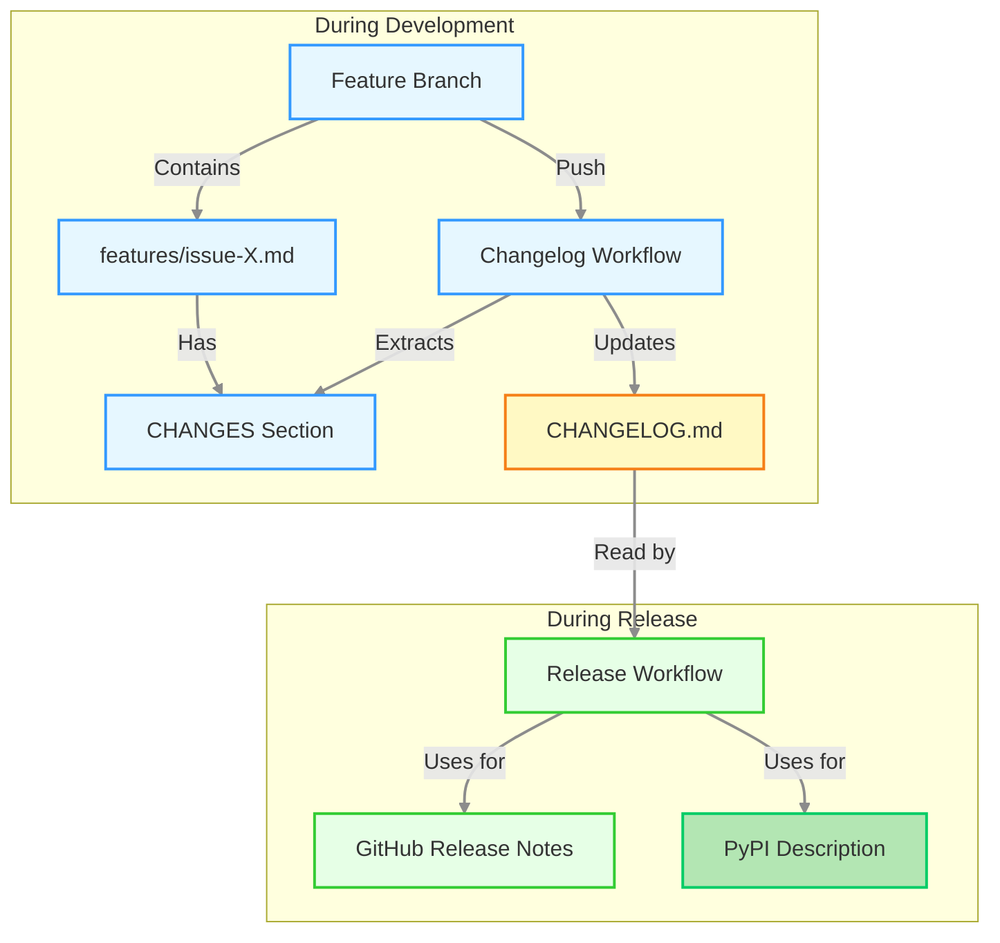

### Changelog Structure

The changelog is organized by version with sections grouped by issue:

```markdown
# Changelog

## [1.1.0] - 2025-11-24

### Issues Closed

- #26: Add Parameter Unset Capability
- #27: Pivot from Config Focus to Param Focus
- #33: Param Allowed Values

### Additions

**Issue #26:**

- `unset_param()` removes parameter value completely from configuration
- `reset_param()` restores parameter to default value
- `PARAM_IMMUTABLE` constant marks parameter as write-once

**Issue #27:**

- `get_param()` retrieves parameter value with automatic type conversion
- `set_param()` stores parameter value after validation
- `join_param()` adds to existing parameter value

### Changes

**Issue #26:**

- `set_param()` now checks immutability before modifications

**Issue #27:**

- Parameter getters consolidated to single `get_param()` function
- Parameter setters split into `set_param()` and `join_param()`

### Documentation

**Issue #26:**

- `doc/parameters.md` added section on unsetting and resetting parameters
- `examples/params_unset.py` demonstrates parameter lifecycle

**Issue #27:**

- `doc/parameters.md` added parameter API section
- `doc/api-reference.md` added Parameter API section
```

### Generation Process

1. **Automatic Extraction** - The changelog workflow extracts CHANGES sections from plan files in `features/`

2. **Organization by Issue** - Each section groups items by issue number for clarity

3. **Stat Line Filtering** - Statistical summary lines (e.g., "11 parameter examples changed") are automatically removed

4. **Version Targeting** - Plan files are matched to versions by:
   - Version in filename (e.g., `issue-26-param-1.1.0.md`)
   - Version in CHANGES header (e.g., `## CHANGES for v1.1.0 Release`)

### Manual Changelog Updates

While the changelog is automatically generated, you can manually edit it if needed:

1. Edit `CHANGELOG.md` directly
2. The next automatic generation will replace the version entry
3. To preserve manual edits, remove the plan files for that version from `features/`

## Troubleshooting

[⬆ Back to Top](#table-of-contents)

### Release Workflow Fails

If the release workflow fails:

1. Check the workflow logs in the Actions tab to identify the failure point
2. Common issues:
   - Tests failing (fix tests and retry)
   - Missing `PYPI_API_TOKEN` secret (add in repository settings)
   - Permission issues (check repository permissions)

### Version Already Published

If you try to publish a version that already exists on PyPI:

1. The workflow will fail at the PyPI upload step
2. You cannot overwrite existing PyPI versions
3. Manually increment the version in `setup.cfg` and retry

### Rollback a Release

To rollback a release:

1. The PyPI package cannot be deleted (PyPI policy)
2. Create a new patch release with fixes
3. You can delete the GitHub Release and tag if needed:
   ```bash
   git tag -d v1.0.0
   git push origin :refs/tags/v1.0.0
   ```

## Configuration

[⬆ Back to Top](#table-of-contents)

### PyPI Trusted Publisher

This project uses **PyPI Trusted Publisher** for secure, token-free publishing:

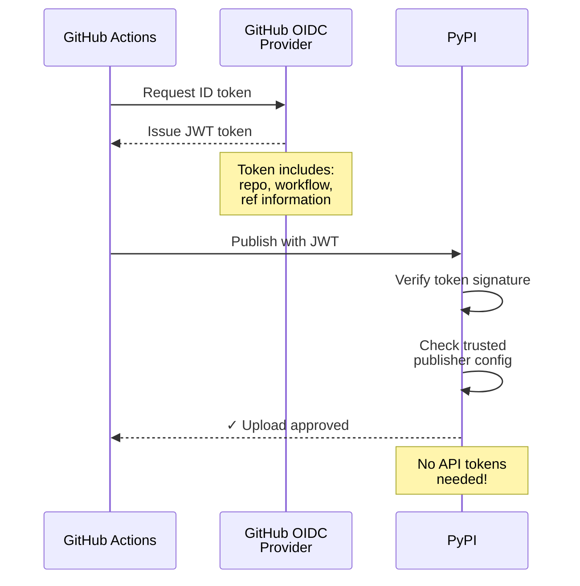

**How it works:**
1. GitHub Actions requests an OpenID Connect (OIDC) token
2. The token contains repository and workflow information
3. PyPI verifies the token and checks trusted publisher configuration
4. If configuration matches, upload is approved

**Setup** (one-time configuration):

1. Go to PyPI project settings: <https://pypi.org/manage/project/spafw37/settings/publishing/>
2. Add "Trusted Publishers" for both release workflows:
   
   **For stable releases (PyPI):**
   - **Owner**: `minouris`
   - **Repository name**: `spafw37`
   - **Workflow name**: `release-common.yml`
   - **Environment name**: (leave blank)
   
   **For dev releases (TestPyPI):**
   - Go to TestPyPI project settings: <https://test.pypi.org/manage/project/spafw37/settings/publishing/>
   - **Owner**: `minouris`
   - **Repository name**: `spafw37`
   - **Workflow name**: `release-common.yml`
   - **Environment name**: (leave blank)
   
3. Save the configurations

**Benefits**:
- No API tokens to manage or rotate
- More secure (scoped to specific workflow)
- Automatic authentication via OIDC
- No secrets to configure in GitHub

### Workflow Permissions

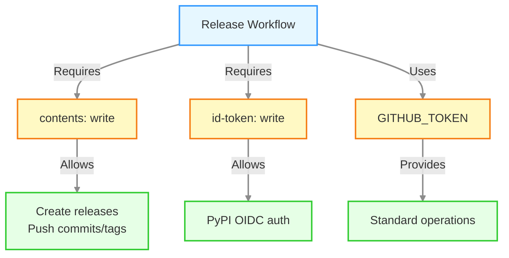

The unified release workflow (`release-common.yml`) requires:
- `contents: write` - For creating releases and pushing commits/tags
- `id-token: write` - For PyPI Trusted Publisher OIDC authentication
- Standard `GITHUB_TOKEN` permissions for other operations

Both launcher workflows (`release-dev.yml` and `release-stable.yml`) inherit these permissions when calling the unified workflow.

### GitHub Secrets

The following secrets can be configured in repository settings:

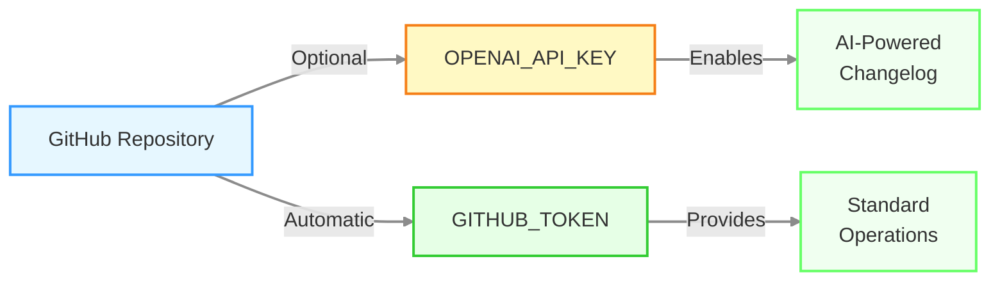

- `OPENAI_API_KEY` - *Optional* - OpenAI API key for AI-powered changelog generation (currently unused - changelog generated from plan files)
- `GITHUB_TOKEN` - Automatically provided by GitHub Actions
