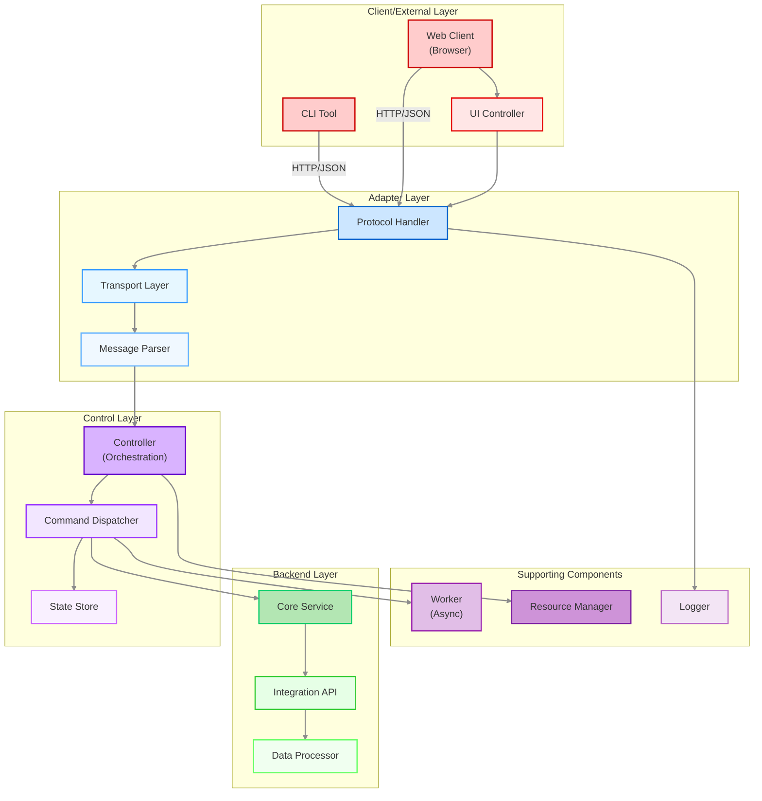
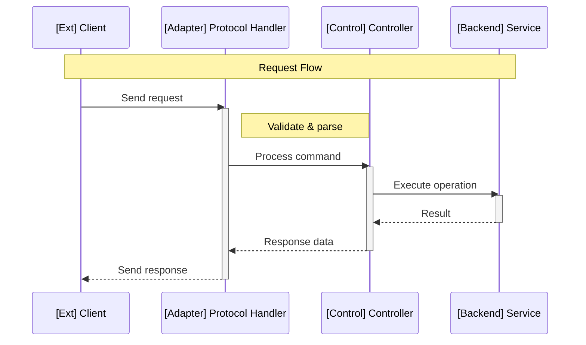
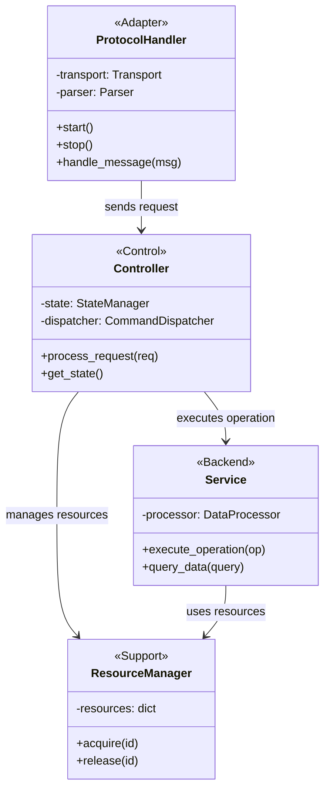
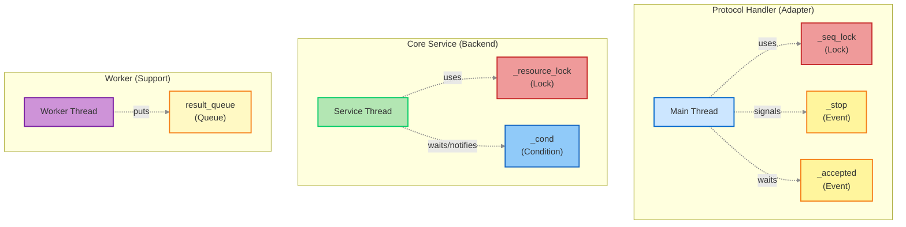
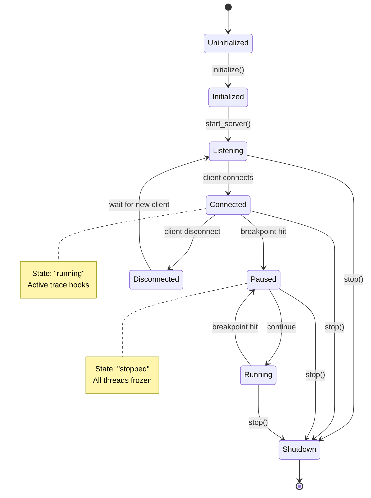
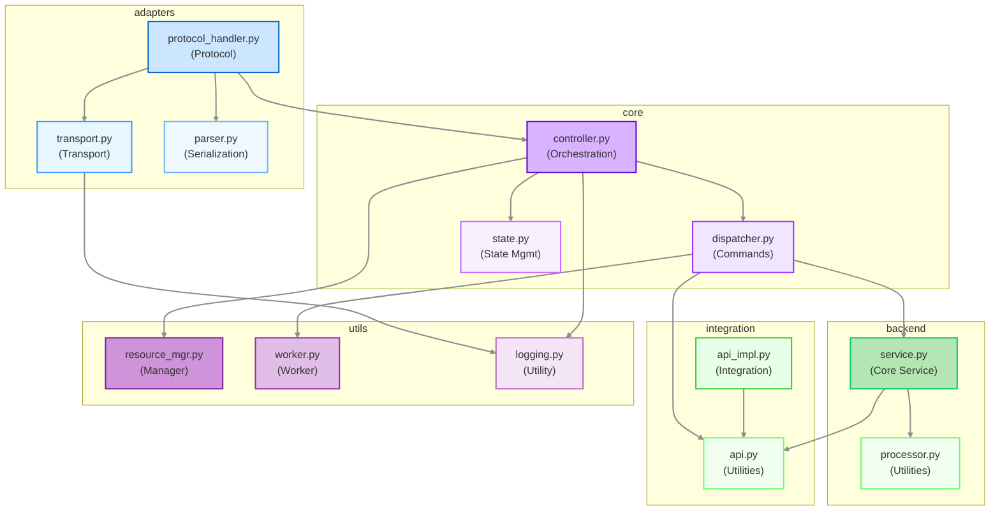

## Mermaid Diagram Examples

### Styling Support by Diagram Type

**Styling support varies by diagram type:**
- ✅ **Graph/Flowchart** (`graph TB`, `flowchart LR`): Full support for `classDef` and custom styling
- ❌ **Sequence diagrams** (`sequenceDiagram`): No custom styling - use participant prefixes `[Layer]`
- ❌ **Class diagrams** (`classDiagram`): No custom styling - rely on structure and annotations
- ⚠️  **State diagrams** (`stateDiagram-v2`): Limited styling support

---

### Example: Layer-Based Component Diagram

Shows layered architecture with components in each layer:

---

### Example: Sequence Diagram

Shows message flow across components. **Note:** Sequence diagrams don't support custom colours - use participant prefixes to indicate layers.

**Layer prefix convention:**
- `[Ext]` - Client/External Layer
- `[Adapter]` - Adapter Layer
- `[Control]` - Control Layer
- `[Backend]` - Backend/Data Layer
- `[Support]` - Supporting Components

---

### Example: Class Diagram

Shows class structure and relationships. **Note:** Class diagrams don't support custom styling - use clear naming and structure.

**Stereotype convention:**
- `<<Adapter>>` - Adapter Layer components
- `<<Control>>` - Control Layer components
- `<<Backend>>` - Backend/Data Layer components
- `<<Support>>` - Supporting components

---

### Example: Component with Synchronisation

Shows components with internal synchronisation primitives:

---

### Example: State Diagram

Shows component lifecycle and state transitions:

---

### Example: Data Flow

Shows how data flows through system layers:

```mermaid
graph LR
    subgraph input["Input"]
        json["JSON<br/>Message"]
    end
    
    subgraph parse["Parse/Validate"]
        deserialize["Deserialize"]
        validate["Validate Schema"]
    end
    
    subgraph process["Process"]
        dispatch["Command<br/>Dispatcher"]
        execute["Execute<br/>Handler"]
    end
    
    subgraph backend["Backend"]
        service["Service<br/>Handler"]
        query["Data<br/>Query"]
    end
    
    subgraph output["Output"]
        serialize["Serialize<br/>Response"]
        response["JSON<br/>Response"]
    end
    
    json --> deserialize
    deserialize --> validate
    validate --> dispatch
    dispatch --> execute
    execute --> service
    service --> query
    query --> serialize
    serialize --> response
    
    classDef clientStyle fill:#ffe6e6,stroke:#cc0000,stroke-width:2px,color:#333
    classDef frontsideStyle fill:#e6f7ff,stroke:#0066cc,stroke-width:2px,color:#333
    classDef centralStyle fill:#f2e6ff,stroke:#6600cc,stroke-width:2px,color:#333
    classDef backendStyle fill:#e6ffe6,stroke:#00cc66,stroke-width:2px,color:#333
    
    class json,response clientStyle
    class deserialize,validate,serialize frontsideStyle
    class dispatch,execute centralStyle
    class service,query backendStyle
    
    linkStyle default stroke:#8c8c8c,stroke-width:2px
```

---

### Example: Thread Interaction

Shows how threads interact with shared resources:

```mermaid
graph TB
    subgraph main["Main Thread"]
        main_code["Application Code"]
    end
    
    subgraph server_thread["Server Thread"]
        accept["Accept Connections"]
        recv["Receive Messages"]
        send["Send Responses"]
    end
    
    subgraph service_thread["Service Thread"]
        process_request["process_request()"]
        handle_operation["handle_operation()"]
        prepare_response["prepare_response()"]
    end
    
    subgraph worker_thread["Worker Thread"]
        process_task["Process Task"]
        return_result["Return Result"]
    end
    
    subgraph shared["Shared State"]
        resource_state[("Resource<br/>State")]
        data_cache[("Data<br/>Cache")]
        event_queue[("Event<br/>Queue")]
    end
    
    main_code -.reads.-> resource_state
    recv -.writes.-> resource_state
    handle_operation -.reads.-> resource_state
    
    recv -.enqueues.-> event_queue
    process_request -.enqueues.-> event_queue
    send -.dequeues.-> event_queue
    
    process_task -.writes.-> data_cache
    send -.reads.-> data_cache
    
    classDef threadBoxStyle fill:#d9b3ff,stroke:#6600cc,stroke-width:2px,color:#333
    classDef sharedStyle fill:#fff59d,stroke:#f57f17,stroke-width:3px,color:#333
    
    class main_code,accept,recv,send,process_request,handle_operation,prepare_response,process_task,return_result threadBoxStyle
    class resource_state,data_cache,event_queue sharedStyle
    
    linkStyle default stroke:#8c8c8c,stroke-width:2px
```

---

### Example: Module Dependencies

Shows relationships between modules:

---