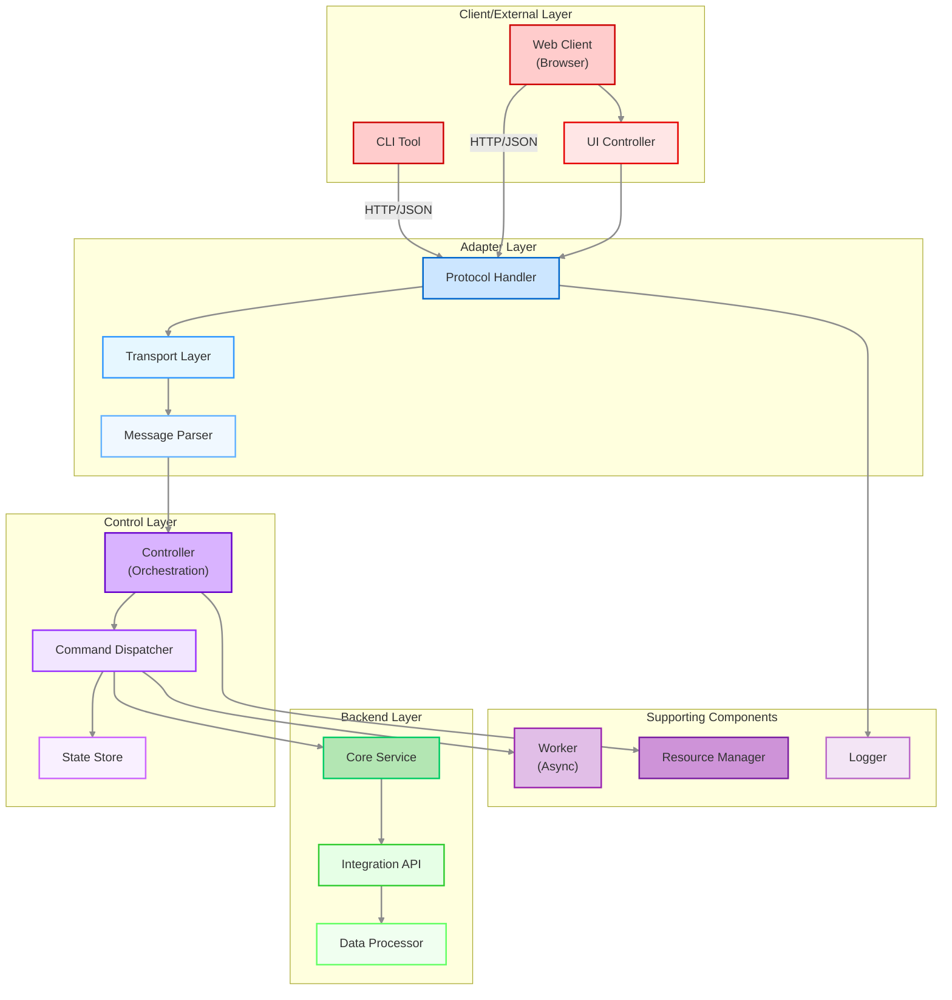
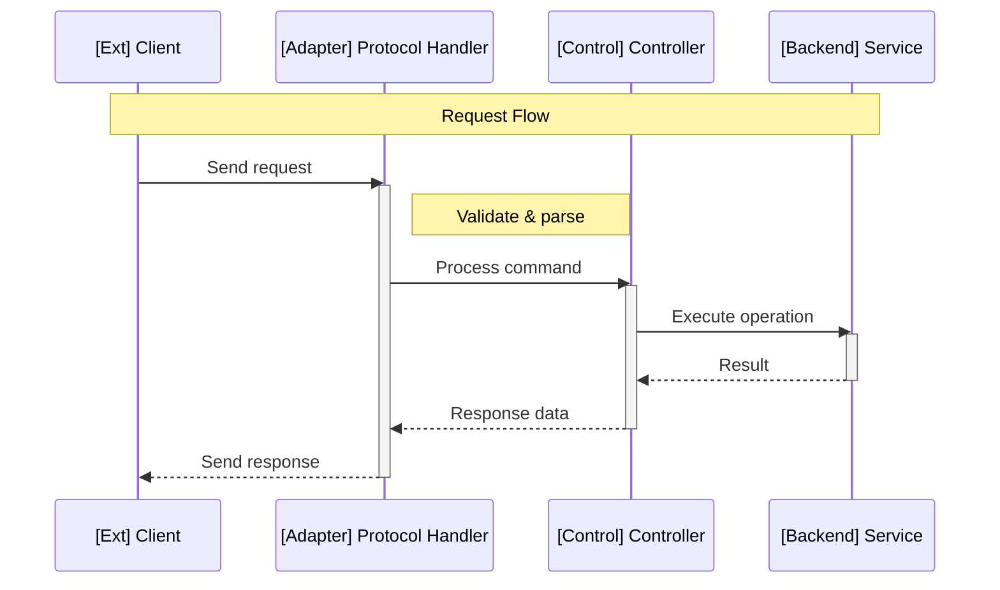
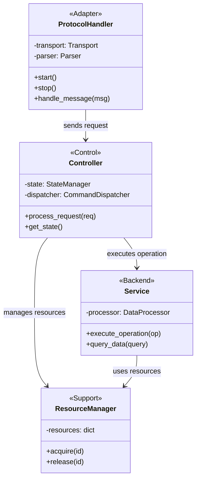
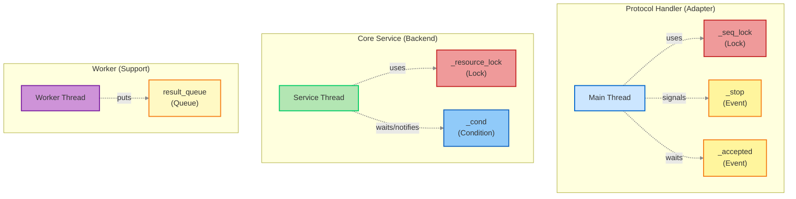
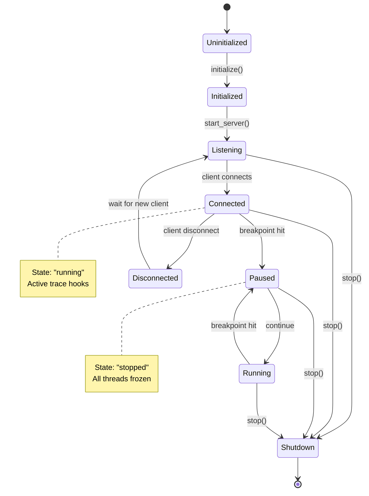
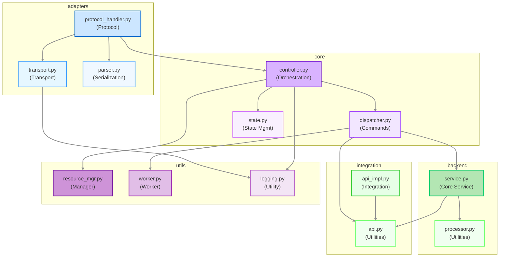

# Mermaid Diagram Standards

This document defines the standard colour schemes, styling conventions, and best practices for Mermaid diagrams across all documentation.

## Purpose

Maintaining consistent visual language across diagrams helps readers:
- Quickly identify component types and layers
- Understand relationships between diagrams
- Navigate complex documentation

**Related Instructions:**
- See `architecture.instructions.md` for architecture documentation standards
- See `documentation.instructions.md` for general documentation guidelines


## Colour Palette by Layer

Use consistent colours to represent different architectural layers. Each layer uses a family of related colours to distinguish between external-facing, internal, and supporting components.

### Client/External Layer
**Use for:** External interfaces, user-facing components, CLI tools

#### External Components (user-facing)
- **Fill:** `#ffcccc` (medium red/pink)
- **Stroke:** `#cc0000` (dark red)
- **Text:** `#333` (dark grey)
- **Semantic meaning:** Direct user interaction points

#### Internal Client Components
- **Fill:** `#ffe6e6` (light red/pink)
- **Stroke:** `#e60000` (medium-dark red)
- **Text:** `#333` (dark grey)
- **Semantic meaning:** Client-side logic, UI controllers

---

### Adapter Layer (Protocol/Transport)
**Use for:** Protocol adapters, transport handlers, serialisation, authentication

#### Protocol Handler (external-facing)
- **Fill:** `#cce6ff` (medium blue)
- **Stroke:** `#0066cc` (dark blue)
- **Text:** `#333` (dark grey)
- **Semantic meaning:** Protocol implementation, message routing

#### Transport Layer
- **Fill:** `#e6f7ff` (light blue)
- **Stroke:** `#3399ff` (medium blue)
- **Text:** `#333` (dark grey)
- **Semantic meaning:** Socket handling, stream management

#### Serialisation/Parsing
- **Fill:** `#f0f8ff` (very light blue)
- **Stroke:** `#66b3ff` (light-medium blue)
- **Text:** `#333` (dark grey)
- **Semantic meaning:** Message parsing, data serialisation

---

### Control Layer
**Use for:** Core orchestration, state management, command processing

#### Core Controller (orchestration)
- **Fill:** `#d9b3ff` (medium purple)
- **Stroke:** `#6600cc` (dark purple)
- **Text:** `#333` (dark grey)
- **Semantic meaning:** Main control flow, session management

#### Command Processing
- **Fill:** `#f2e6ff` (light purple)
- **Stroke:** `#9933ff` (medium purple)
- **Text:** `#333` (dark grey)
- **Semantic meaning:** Command dispatch, request handling

#### State Management
- **Fill:** `#f9f0ff` (very light purple)
- **Stroke:** `#cc66ff` (light-medium purple)
- **Text:** `#333` (dark grey)
- **Semantic meaning:** State storage, cache management

---

### Backend/Data Layer
**Use for:** Data access, runtime integration, instrumentation

#### Core Backend
- **Fill:** `#b3e6b3` (medium green)
- **Stroke:** `#00cc66` (dark green)
- **Text:** `#333` (dark grey)
- **Semantic meaning:** Core backend logic, runtime integration

#### Integration Layer
- **Fill:** `#e6ffe6` (light green)
- **Stroke:** `#33cc33` (medium green)
- **Text:** `#333` (dark grey)
- **Semantic meaning:** External system integration

#### Utilities
- **Fill:** `#f0fff0` (very light green)
- **Stroke:** `#66ff66` (light-medium green)
- **Text:** `#333` (dark grey)
- **Semantic meaning:** Helper functions, utilities

---

### Supporting Components
**Use for:** Cross-cutting concerns, utilities, helpers

#### Managers (cross-cutting)
- **Fill:** `#ce93d8` (medium purple/magenta)
- **Stroke:** `#7b1fa2` (dark purple)
- **Text:** `#333` (dark grey)
- **Semantic meaning:** Resource management, coordination

#### Workers/Async Components
- **Fill:** `#e1bee7` (light purple/magenta)
- **Stroke:** `#9c27b0` (medium purple)
- **Text:** `#333` (dark grey)
- **Semantic meaning:** Background processing, async operations

#### Utilities/Helpers
- **Fill:** `#f3e5f5` (very light purple/magenta)
- **Stroke:** `#ba68c8` (light-medium purple)
- **Text:** `#333` (dark grey)
- **Semantic meaning:** Helper functions, common utilities

### Synchronisation Primitives
**Use for:** Locks, conditions, queues, events

- **Locks:** Fill `#ef9a9a`, Stroke `#c62828`, Text `#333`
- **Conditions:** Fill `#90caf9`, Stroke `#1565c0`, Text `#333`
- **Queues:** Fill `#fff9c4`, Stroke `#f57f17`, Text `#333`
- **Events:** Fill `#fff59d`, Stroke `#f57f17`, Text `#333`

---

## Standard Stroke Width

All diagrams should use:
- **Default stroke width:** `2px`
- **Emphasis/boundary stroke:** `3px`

---

## Mermaid Best Practices

### General Guidelines

1. **Syntax Constraints**
   - **NEVER nest round parentheses inside square brackets** in node labels (e.g., `FA[Adapter(transport)]` is invalid)
   - Use line breaks instead: `FA[Adapter<br/>transport]`
   - Avoid bracketed notes inside square-bracket nodes
   - Use `note` keyword or separate shapes for annotations

2. **Diagram Size**
   - Create small, focused diagrams illustrating specific concepts
   - Avoid monolithic diagrams trying to show everything
   - Link related diagrams together

3. **Styling**
   - Always define and apply `classDef` styles for graph/flowchart diagrams
   - Sequence and class diagrams don't support custom styling
   - Use participant prefixes for sequence diagrams: `[Ext]`, `[Adapter]`, `[Control]`, `[Backend]`, `[Support]`

4. **Clarity**
   - Label connections clearly: "calls", "sends", "depends on", etc.
   - Use subgraphs to group related components
   - Keep layer colours consistent across all diagrams

5. **Notes and Colour Usage**
   - For state diagrams: Use empty lines before/after note text for visual spacing
   - For flowcharts (v11.3.0+): Use comment shapes `@{ shape: comment }` or text blocks `@{ shape: text }` for annotations
   - Style annotation nodes with light backgrounds and good text contrast
   - Avoid extreme colours like pure black (`#000`) or pure white (`#fff`) for text and backgrounds
   - Use softer colours like dark grey (`#333`) for text on light backgrounds
   - Ensure adequate contrast between link colours and background fills

5. **Notes and Annotations**
   - Add padding to notes for better readability (use background colours with good contrast)
   - Avoid extreme colours like pure black (#000) or pure white (#fff) for text and backgrounds
   - Use softer colours like dark grey (#333) for text on light backgrounds

---

## Mermaid Diagram Examples

### Styling Support by Diagram Type

**Styling support varies by diagram type:**
- ✅ **Graph/Flowchart** (`graph TB`, `flowchart LR`): Full support for `classDef` and custom styling
- ❌ **Sequence diagrams** (`sequenceDiagram`): No custom styling - use participant prefixes `[Layer]`
- ❌ **Class diagrams** (`classDiagram`): No custom styling - rely on structure and annotations
- ⚠️  **State diagrams** (`stateDiagram-v2`): Limited styling support

---

### Example: Layer-Based Component Diagram

Shows layered architecture with components in each layer:



---

### Example: Sequence Diagram

Shows message flow across components. **Note:** Sequence diagrams don't support custom colours - use participant prefixes to indicate layers.



**Layer prefix convention:**
- `[Ext]` - Client/External Layer
- `[Adapter]` - Adapter Layer
- `[Control]` - Control Layer
- `[Backend]` - Backend/Data Layer
- `[Support]` - Supporting Components

---

### Example: Class Diagram

Shows class structure and relationships. **Note:** Class diagrams don't support custom styling - use clear naming and structure.



**Stereotype convention:**
- `<<Adapter>>` - Adapter Layer components
- `<<Control>>` - Control Layer components
- `<<Backend>>` - Backend/Data Layer components
- `<<Support>>` - Supporting components

---

### Example: Component with Synchronisation

Shows components with internal synchronisation primitives:



---

### Example: State Diagram

Shows component lifecycle and state transitions:



---

### Example: Data Flow

Shows how data flows through system layers:

```mermaid
graph LR
    subgraph input["Input"]
        json["JSON<br/>Message"]
    end
    
    subgraph parse["Parse/Validate"]
        deserialize["Deserialize"]
        validate["Validate Schema"]
    end
    
    subgraph process["Process"]
        dispatch["Command<br/>Dispatcher"]
        execute["Execute<br/>Handler"]
    end
    
    subgraph backend["Backend"]
        service["Service<br/>Handler"]
        query["Data<br/>Query"]
    end
    
    subgraph output["Output"]
        serialize["Serialize<br/>Response"]
        response["JSON<br/>Response"]
    end
    
    json --> deserialize
    deserialize --> validate
    validate --> dispatch
    dispatch --> execute
    execute --> service
    service --> query
    query --> serialize
    serialize --> response
    
    classDef clientStyle fill:#ffe6e6,stroke:#cc0000,stroke-width:2px,color:#333
    classDef frontsideStyle fill:#e6f7ff,stroke:#0066cc,stroke-width:2px,color:#333
    classDef centralStyle fill:#f2e6ff,stroke:#6600cc,stroke-width:2px,color:#333
    classDef backendStyle fill:#e6ffe6,stroke:#00cc66,stroke-width:2px,color:#333
    
    class json,response clientStyle
    class deserialize,validate,serialize frontsideStyle
    class dispatch,execute centralStyle
    class service,query backendStyle
    
    linkStyle default stroke:#8c8c8c,stroke-width:2px
```



---

### Example: Thread Interaction

Shows how threads interact with shared resources:

```mermaid
graph TB
    subgraph main["Main Thread"]
        main_code["Application Code"]
    end
    
    subgraph server_thread["Server Thread"]
        accept["Accept Connections"]
        recv["Receive Messages"]
        send["Send Responses"]
    end
    
    subgraph service_thread["Service Thread"]
        process_request["process_request()"]
        handle_operation["handle_operation()"]
        prepare_response["prepare_response()"]
    end
    
    subgraph worker_thread["Worker Thread"]
        process_task["Process Task"]
        return_result["Return Result"]
    end
    
    subgraph shared["Shared State"]
        resource_state[("Resource<br/>State")]
        data_cache[("Data<br/>Cache")]
        event_queue[("Event<br/>Queue")]
    end
    
    main_code -.reads.-> resource_state
    recv -.writes.-> resource_state
    handle_operation -.reads.-> resource_state
    
    recv -.enqueues.-> event_queue
    process_request -.enqueues.-> event_queue
    send -.dequeues.-> event_queue
    
    process_task -.writes.-> data_cache
    send -.reads.-> data_cache
    
    classDef threadBoxStyle fill:#d9b3ff,stroke:#6600cc,stroke-width:2px,color:#333
    classDef sharedStyle fill:#fff59d,stroke:#f57f17,stroke-width:3px,color:#333
    
    class main_code,accept,recv,send,process_request,handle_operation,prepare_response,process_task,return_result threadBoxStyle
    class resource_state,data_cache,event_queue sharedStyle
    
    linkStyle default stroke:#8c8c8c,stroke-width:2px
```



---

### Example: Module Dependencies

Shows relationships between modules:



---

## Quick Reference: Styling Classes

**Use with graph/flowchart diagrams only** (sequence and class diagrams don't support custom styling):

```
%% Client/External Layer
classDef clientExtStyle fill:#ffcccc,stroke:#cc0000,stroke-width:2px,color:#333
classDef clientIntStyle fill:#ffe6e6,stroke:#e60000,stroke-width:2px,color:#333

%% Adapter Layer
classDef adapterProtoStyle fill:#cce6ff,stroke:#0066cc,stroke-width:2px,color:#333
classDef adapterTransStyle fill:#e6f7ff,stroke:#3399ff,stroke-width:2px,color:#333
classDef adapterParseStyle fill:#f0f8ff,stroke:#66b3ff,stroke-width:2px,color:#333

%% Control Layer
classDef controlCoreStyle fill:#d9b3ff,stroke:#6600cc,stroke-width:2px,color:#333
classDef controlCmdStyle fill:#f2e6ff,stroke:#9933ff,stroke-width:2px,color:#333
classDef controlStateStyle fill:#f9f0ff,stroke:#cc66ff,stroke-width:2px,color:#333

%% Backend Layer
classDef backendCoreStyle fill:#b3e6b3,stroke:#00cc66,stroke-width:2px,color:#333
classDef backendIntegStyle fill:#e6ffe6,stroke:#33cc33,stroke-width:2px,color:#333
classDef backendUtilStyle fill:#f0fff0,stroke:#66ff66,stroke-width:2px,color:#333

%% Supporting Components
classDef supportMgrStyle fill:#ce93d8,stroke:#7b1fa2,stroke-width:2px,color:#333
classDef supportWorkerStyle fill:#e1bee7,stroke:#9c27b0,stroke-width:2px,color:#333
classDef supportUtilStyle fill:#f3e5f5,stroke:#ba68c8,stroke-width:2px,color:#333

%% Synchronisation Primitives
classDef lockStyle fill:#ef9a9a,stroke:#c62828,stroke-width:2px,color:#333
classDef condStyle fill:#90caf9,stroke:#1565c0,stroke-width:2px,color:#333
classDef queueStyle fill:#fff9c4,stroke:#f57f17,stroke-width:2px,color:#333
classDef eventStyle fill:#fff59d,stroke:#f57f17,stroke-width:2px,color:#333
```
Then apply with:

```
class protocol adapterProtoStyle
class transport adapterTransStyle
class parser adapterParseStyle
```

---

## Colour Selection Guide

Choose the appropriate style based on the component's architectural role:

| Layer | Role | Style Class | Colour Family |
|-------|------|-------------|---------------|
| **Client/External** | User-facing, external | `clientExtStyle` | Medium red/pink |
| | Internal client logic | `clientIntStyle` | Light red/pink |
| **Adapter** | Protocol handling | `adapterProtoStyle` | Medium blue |
| | Transport/streams | `adapterTransStyle` | Light blue |
| | Parsing/serialisation | `adapterParseStyle` | Very light blue |
| **Control** | Core orchestration | `controlCoreStyle` | Medium purple |
| | Command processing | `controlCmdStyle` | Light purple |
| | State management | `controlStateStyle` | Very light purple |
| **Backend** | Core backend logic | `backendCoreStyle` | Medium green |
| | Integration layer | `backendIntegStyle` | Light green |
| | Backend utilities | `backendUtilStyle` | Very light green |
| **Support** | Managers | `supportMgrStyle` | Medium magenta |
| | Workers/async | `supportWorkerStyle` | Light magenta |
| | Utilities/helpers | `supportUtilStyle` | Very light magenta |

**Rule of thumb:** Darker shades = external-facing or core functionality, lighter shades = internal or supporting functionality.

---
